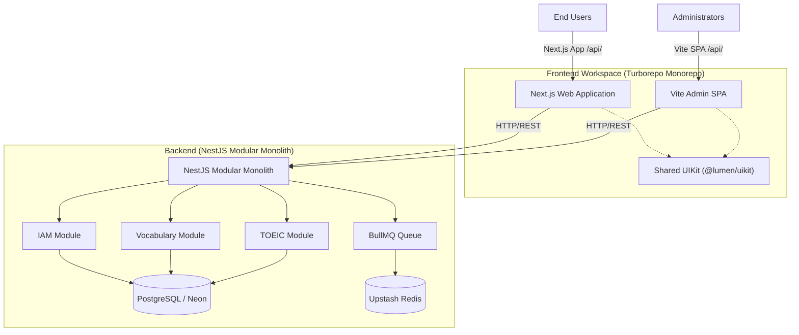

# Lumen Platform - Intelligent English & TOEIC Learning Ecosystem

Lumen is an all-in-one educational platform that helps learners master English and prepare for the TOEIC exam. It combines cognitive-science learning methods with a modern web architecture to deliver a personalized, fast, and interactive experience.

## Core Philosophy & Methodology

Lumen is built around active learning rather than passive content consumption:

1. Smart Vocabulary Acquisition (Spaced Repetition): an intelligent scheduler based on the Ebbinghaus Forgetting Curve (SM-2 algorithm via `ts-fsrs`) tracks memory retention per word and surfaces flashcards at the optimal recall moment.
2. Daily Dictation (Active Listening): dictation exercises convert auditory signals into text, strengthening listening comprehension and spelling.
3. Standard TOEIC Mock Tests: a realistic simulator with Listening (Parts 1-4) and Reading (Parts 5-7), full scoring, timers, and per-question explanations.
4. Grammar Studio & Active Reading: read real-world articles, translate any word or phrase with one click, and study bite-sized grammar units with micro-quizzes.

## Authentication (Passwordless)

Lumen does not use passwords. There are exactly two login methods:

- Google OAuth2: the client sends a Google ID token; the server verifies it and logs the user in (creating the account on first use).
- Email OTP: the user enters an email, receives a 6-digit code, and enters it to log in. The account is auto-created on first verification.

Backend endpoints (prefix `/api/iam`):

- `POST /email-otp/send` - generates a 6-digit OTP, stores a hashed copy in Redis (5-minute TTL), and emails it.
- `POST /login` - verifies the OTP, auto-registers the user if needed (`AuthProvider.EMAIL`), and returns access + refresh tokens.
- `POST /google-login` - verifies a Google ID token and returns tokens.
- `POST /refresh`, `POST /logout`, `GET /me`, `GET /sessions`, `PUT /profile`.

The `AuthProvider` enum is `GOOGLE` | `EMAIL`. The `password` column was removed from the `iam_users` table (see `backend/migrations/0001_drop_iam_users_password.sql`).

## System Architecture

The platform is organized as a parent repository with two workspaces: a NestJS backend and a Turborepo frontend monorepo.



Repository layout:

- `backend/` - Modular Monolith API (NestJS).
- `frontend/` - Turborepo monorepo containing `apps/web`, `apps/admin`, and shared `packages/`.

## Technical Stack

### Backend
- NestJS 11 (Modular Monolith, DDD, CQRS via `@nestjs/cqrs`)
- Fastify platform adapter
- PostgreSQL via TypeORM (hosted on Neon)
- BullMQ + Upstash Redis for background jobs (email sending, score processing)
- JWT authentication (`@nestjs/jwt`) with access + refresh tokens stored as HTTP-only cookies
- Resend for transactional email (verification OTP template)
- Swagger / OpenAPI docs
- Throttler for rate limiting

### Frontend
- `apps/web`: Next.js 16 (App Router), React 19, Tailwind CSS v4, next-intl (i18n: en/vi), Framer Motion, TanStack Query, Zustand, React Hook Form + Zod, `@react-oauth/google`, base-ui. Installable as a PWA via `manifest.ts`.
- `apps/admin`: Vite + React 19 SPA, React Router v7, TanStack Table, Tiptap rich-text editor, Recharts, oxlint.
- Shared packages: `@lumen/uikit` (design system), `@lumen/shared-api` (API clients + DTOs), `@lumen/hooks`, `@lumen/utils`, `@lumen/eslint-config`, `@lumen/typescript-config`.

## Development Setup

### Prerequisites
- Node.js v20+
- pnpm v9+
- Docker Desktop (for local Postgres/Redis, optional if using hosted Neon/Upstash)

### Backend
```bash
cd backend
cp .env.example .env      # fill DATABASE_URL, JWT_*, GOOGLE_CLIENT_ID, UPSTASH_REDIS_URL, RESEND_API_KEY, R2_*, etc.
pnpm install
pnpm run db:up             # local Postgres/Redis via Docker (if used)
pnpm run seed              # seed vocabulary, articles, tests, users
pnpm run start:dev         # http://localhost:3000  (Swagger at /docs or /api)
```

### Frontend
```bash
cd frontend
pnpm install
pnpm run dev               # starts apps/web (default Next port) and apps/admin (Vite port)
```
Per-app scripts live in `apps/web` and `apps/admin` (see their READMEs).

## Environment Variables (backend)
- `NODE_ENV`, `PORT`, `COOKIE_SECRET`, `FRONTEND_URL`, `BACKEND_URL`
- `JWT_SECRET`, `JWT_EXPIRES_IN`, `JWT_REFRESH_SECRET`, `JWT_REFRESH_EXPIRES_IN`
- `DATABASE_URL`
- `GOOGLE_CLIENT_ID`
- `UPSTASH_REDIS_URL`
- `RESEND_API_KEY`
- `R2_ACCESS_KEY`, `R2_SECRET_KEY`, `R2_BUCKET_NAME`, `R2_ENDPOINT`, `R2_PUBLIC_URL`

## CI/CD & Deployment
- Docker: `Dockerfile.web` (Next.js standalone) and `Dockerfile.admin` (Vite static + Nginx).
- GitHub Actions builds images on merge to `main` and pushes to GitHub Container Registry (GHCR), then triggers a Render deploy hook.
- A `Dockerfile.vercel` variant supports Vercel Fluid Compute to avoid platform lock-in.

## Workspaces
- Backend README: `backend/README.md`
- Frontend monorepo README: `frontend/README.md`
- Web app README: `frontend/apps/web/README.md`
- Admin app README: `frontend/apps/admin/README.md`
