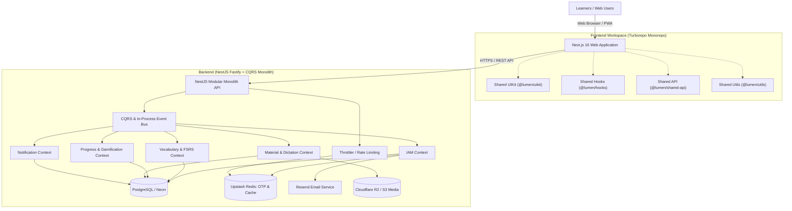

# Lumen - Intelligent Vocabulary Learning Platform

Lumen is an intelligent English vocabulary learning platform built around cognitive science and modern web architecture. It empowers learners to acquire, retain, and master vocabulary effectively through spaced repetition, multi-modal study sessions, and gamified progress tracking.

## Core Philosophy & Methodology

Lumen is built around active recall and deliberate practice:

1. **Smart Vocabulary Acquisition (Spaced Repetition)**: An intelligent scheduler based on the Ebbinghaus Forgetting Curve (via `ts-fsrs`) calculates memory retention per word and surfaces flashcards at the optimal moment for long-term retention.
2. **Multi-Modal Study Sessions**: Dynamic learning queues supporting Flashcards, Multiple-Choice (Definition/Term), and Typing exercises with intelligent distractor generation and real-time audio pronunciation (US/UK).
3. **Daily Dictation (Active Listening)**: Dictation exercises convert auditory signals into typed text, strengthening listening comprehension and spelling accuracy.
4. **Gamified Progress & Habit Formation**: Daily streaks with streak freeze protection, XP leaderboard, mastery level tracking (Levels 0-6), and interactive activity heatmaps.

## Authentication (Passwordless)

Lumen uses a secure, passwordless authentication flow with two login methods:

- **Google OAuth2**: One-tap authentication via Google ID token verification (auto-creates account on first login).
- **Email OTP**: Secure 6-digit verification code delivered via transactional email with a 5-minute TTL stored in Redis.

Backend endpoints (prefix `/api/iam`):

- `POST /email-otp/send` - Generates a 6-digit OTP, stores hashed copy in Redis, and sends email.
- `POST /login` - Verifies OTP, auto-registers user if needed (`AuthProvider.EMAIL`), and sets authentication cookies.
- `POST /google-login` - Verifies Google ID token and returns session tokens.
- `POST /refresh`, `POST /logout`, `GET /me`, `GET /sessions`, `PUT /profile`.

## System Architecture

The platform is structured as a parent workspace comprising a NestJS Fastify DDD backend and a Turborepo frontend monorepo.



Repository layout:

- `backend/` - Modular Monolith API (NestJS Fastify adapter, DDD, CQRS).
- `frontend/` - Turborepo monorepo containing `apps/web` and shared `packages/`.

## Technical Stack

### Backend
- **Framework**: NestJS 11 (Modular Monolith, DDD, CQRS via `@nestjs/cqrs`)
- **HTTP Adapter**: Fastify platform adapter (`@nestjs/platform-fastify`)
- **Database & ORM**: PostgreSQL via TypeORM (hosted on Neon)
- **Caching & OTP**: Upstash Redis (`ioredis` + `cache-manager-redis-yet`)
- **Email**: Resend for transactional verification emails
- **Storage**: Cloudflare R2 / S3 for vocabulary audio and image assets
- **Authentication**: JWT (`@nestjs/jwt`) with access + refresh tokens stored as HTTP-only cookies
- **Spaced Repetition**: `ts-fsrs` algorithm engine
- **Documentation**: Swagger / OpenAPI
- **Quality & Testing**: Jest unit testing across CQRS handlers, event listeners, domain aggregates, and DTOs (under `__tests__/` subfolders)

### Frontend
- **Application**: Next.js 16 (App Router), React 19, Tailwind CSS v4, `next-intl` (i18n: en/vi), Framer Motion, TanStack Query, Zustand, React Hook Form + Zod, `@react-oauth/google`, Base UI. Installable as a Progressive Web App (PWA).
- **Shared Packages**:
  - `@lumen/uikit`: Design system tokens, dialogs, buttons, and UI primitives.
  - `@lumen/shared-api`: Centralized BaseApiService, BaseResponse schemas, and typed `extractApiErrors`.
  - `@lumen/hooks`: Shared hook library (`useKeyPress`, `useBreakpoint`, `useNetworkState`, `useLongPress`, `useCountdown`, `useContinuousRetry`, `useDocumentTitle`, `useFavicon`, `usePreferredLanguage`, etc.).
  - `@lumen/utils`: Generic utilities (timing, string helpers, date formatters).
  - `@lumen/eslint-config` & `@lumen/typescript-config`.
- **Quality & Testing**: Vitest + `@testing-library/react` + `jsdom` with path alias resolution.

## Testing & Quality Gates

Lumen enforces strict automated test verification across both backend and frontend:

- **Backend Unit Tests (Jest)**:
  ```bash
  cd backend
  pnpm test              # runs all unit tests under __tests__/
  pnpm run lint          # ESLint verification
  pnpm exec tsc --noEmit # TypeScript type check
  ```
- **Frontend Unit Tests (Vitest)**:
  ```bash
  cd frontend
  pnpm test              # runs Vitest across apps and shared packages
  pnpm run lint          # ESLint check
  pnpm --filter web exec tsc --noEmit # TypeScript type check
  ```
- **CI / GitHub Actions**:
  - Defined in `.github/workflows/ci.yml`.
  - Dual parallel jobs: `backend-quality-gates` and `frontend-quality-gates` running formatting, linting, typechecking, unit tests, and production builds (`nest build` & `next build`) on every push and pull request.

## Development Setup

### Prerequisites
- Node.js v20+
- pnpm v9+
- Docker Desktop (for local Postgres/Redis, optional if using hosted Neon/Upstash)

### Backend
```bash
cd backend
cp .env.example .env      # fill DATABASE_URL, JWT_*, GOOGLE_CLIENT_ID, UPSTASH_REDIS_URL, RESEND_API_KEY, R2_*, etc.
pnpm install
pnpm run db:up             # local Postgres/Redis via Docker (if used)
pnpm run seed              # seed vocabulary words, folders, and users
pnpm run start:dev         # http://localhost:3000 (Swagger at /docs or /api)
```

### Frontend
```bash
cd frontend
pnpm install
pnpm run dev               # starts apps/web (Next.js dev server)
pnpm test                  # runs Vitest test runner
```

## Environment Variables (backend)
- `NODE_ENV`, `PORT`, `COOKIE_SECRET`, `FRONTEND_URL`, `BACKEND_URL`
- `JWT_SECRET`, `JWT_EXPIRES_IN`, `JWT_REFRESH_SECRET`, `JWT_REFRESH_EXPIRES_IN`
- `DATABASE_URL`
- `GOOGLE_CLIENT_ID`
- `UPSTASH_REDIS_URL`
- `RESEND_API_KEY`
- `R2_ACCESS_KEY`, `R2_SECRET_KEY`, `R2_BUCKET_NAME`, `R2_ENDPOINT`, `R2_PUBLIC_URL`

## Workspaces
- Backend README: `backend/README.md`
- Frontend monorepo README: `frontend/README.md`
- Web app README: `frontend/apps/web/README.md`
