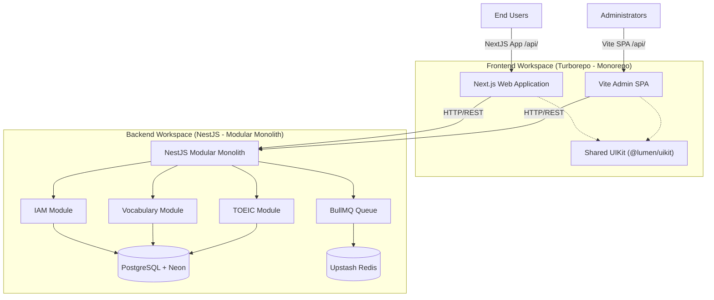

# Lumen Platform - Intelligent English & TOEIC Learning Ecosystem

Lumen is an advanced, all-in-one educational platform engineered to help learners master English and prepare for the TOEIC exam. By combining cognitive science principles with state-of-the-art web architectures, Lumen delivers a personalized, lightning-fast, and highly interactive learning experience.

---

## 💡 Core Philosophy & Methodology

Lumen is designed around proven cognitive methodologies rather than passive consumption:

1. **Smart Vocabulary Acquisition (Spaced Repetition)**: 
   Utilizes an intelligent scheduling engine based on the **Ebbinghaus Forgetting Curve** (using the SuperMemo-2 / SM-2 algorithm via `ts-fsrs`). The system tracks memory retention intervals for each user and schedules flashcards at the exact moment recall is needed to achieve permanent retention.
2. **Daily Dictation (Active Listening)**:
   Focuses on phonics and speech tracking. Dictation exercises force learners to translate auditory signals directly into text, strengthening listening comprehension and spelling.
3. **Standard TOEIC Mock Tests**:
   A realistic simulator mimicking the official TOEIC test layout, featuring sections for Listening (Parts 1-4) and Reading (Parts 5-7), full scoring guides, timer constraints, and granular review explanations.
4. **Grammar Studio & Active Reading**:
   Allows readers to read real-world articles, instantly translate any word or phrase with one click, and study bite-sized grammar units with interactive micro-quizzes.

---

## 🛠️ System Architecture & Repository Structure

The platform is designed as a **submodule-based multi-repository** to enforce clean boundaries and independent deployment cycles.



### 📦 Repository Organization
* **Root Repository (`lumen`)**: The master orchestration repository linking submodules.
* **Backend Submodule (`backend` / `lumen-server`)**: A Modular Monolith API.
* **Frontend Submodule (`frontend` / `lumen-web`)**: A Turborepo monorepo for client web interfaces.

---

## 🚀 Deep-Dive: Technical Stack & Core Modules

### 1. Backend: NestJS Modular Monolith
The backend prioritizes stability, domain segregation, and type safety:
* **Architecture**: **Modular Monolith** applying **Domain-Driven Design (DDD)** patterns. Each business capability (IAM, Quiz, TOEIC, Material, Vocabulary) is isolated into a separate module with low coupling.
* **Database & ORM**: **PostgreSQL** (hosted on Neon) mapped via **TypeORM**. Database operations use transactional guarantees for complex state changes.
* **Queue & Async Jobs**: **BullMQ** backed by **Upstash Redis** handles asynchronous long-running tasks, such as generating feedback, sending emails, or processing test scores.
* **Mail Service**: Integrates **Resend** with precompiled **Handlebars** email templates (e.g., verification email, password reset).
* **Keep-Alive Worker**: Built-in `KeepAliveService` that pings its own API endpoint every 15 minutes to prevent the free tier Render containers and serverless Neon Database from entering sleep mode.

### 2. Frontend: Turborepo Monorepo
The client-side infrastructure leverages modern performance optimization:
* **Orchestration**: **Turborepo** controls build caching, workspace pipelines, and task parallelization.
* **apps/web**: Built with **Next.js** using the App Router. Utilizes Server-Side Rendering (SSR) for SEO-sensitive public pages, and dynamic client-side rendering for the interactive dashboard.
* **apps/admin**: Built with **React** and **Vite** as a fast, light-weight SPA for content creators and system administrators.
* **packages/uikit**: A shared internal design system package exporting typography, standard layouts, form elements, buttons, and stateful widgets.

---

## 🎨 Design System: Exaggerated Minimalism

Lumen adopts a highly curated **"Exaggerated Minimalism"** design system defined in `@lumen/uikit`:

* **Color Palette**: Uses semantic CSS variables supporting full light/dark mode adjustments. Colors are clean, utilizing slate/zinc backgrounds paired with indigo primary accents to prevent visual fatigue.
* **Shared Icon Registry**:
  Instead of importing heavy icon packages everywhere, the frontend has a centralized `Icons` component that exports a strictly typed list of standard SVG assets (e.g., `users`, `book`, `star`, `trophy`).
* **Micro-Animations**:
  Leverages **Framer Motion** for subtle micro-interactions, such as slide-ins, spring-based hover translations on statistics blocks, and smooth accordion transitions.

---

## ⚙️ Development Setup & Configuration

### Prerequisites
* Node.js (v20+)
* pnpm (v9+)
* Docker Desktop

### 1. Setting Up the Backend
Navigate to the backend directory and set up environment variables:

```bash
cd backend
cp .env.example .env
pnpm install
```

Configure your `.env` with the database credentials, then:
```bash
pnpm run db:up         # Provision local services (Postgres/Redis) via Docker
pnpm run seed          # Seed database with initial vocabulary & study material
pnpm run start:dev     # Start NestJS development server (Port 3000)
```

### 2. Setting Up the Frontend
Navigate to the frontend directory:

```bash
cd ../frontend
pnpm install
pnpm run dev           # Concurrently launches Web (Port 3001) and Admin (Port 3002)
```

---

## 🐳 CI/CD & Deployment Architecture

Our deployment pipeline automates compilation and image generation:

1. **Docker Builds**:
   * **`Dockerfile.web` (Next.js)**: Utilizes Next.js `standalone` output mode to shrink the final Docker image size down to <120MB, running in a minimal Alpine environment.
   * **`Dockerfile.admin` (Vite SPA)**: Builds static assets and serves them through **Nginx Alpine**. It features a dynamic `PORT` template injector so it can run out-of-the-box on serverless port systems.
2. **GitHub Actions Workflow**:
   * Builds the Docker image upon every merge to `main`.
   * Pushes the image to **GitHub Container Registry (GHCR)**.
   * Sends a deploy trigger webhook (Render Deploy Hook) to update the running containers instantly without manual intervention.
3. **Multi-Platform Portability**:
   * Features dedicated `Dockerfile.vercel` configurations in the subfolders. This allows Vercel's Fluid Compute engine to build the same multi-stage Docker setup directly, preventing platform lock-in.
