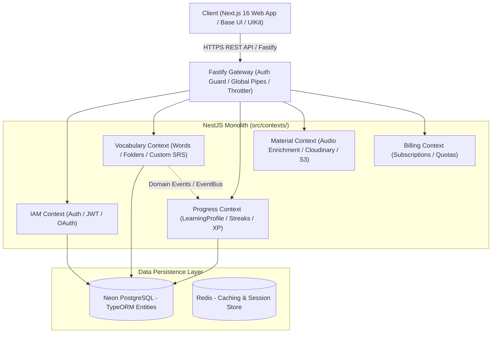

# Architecture and Deployment Specification — Lumen

> **System Overview**: Modular Monolith with Domain-Driven Design (DDD) & CQRS.
> **Technology Stack**: Next.js 16 (React 19 Turbopack App Router) + NestJS 11 (Fastify Adapter) + PostgreSQL (Neon Database) + Redis (ioredis).
> **Last Updated**: 2026-09-21

---

## 1. High-Level Architecture

Lumen follows a **Modular Monolith** architecture with strict **Domain-Driven Design (DDD)** and **Command Query Responsibility Segregation (CQRS)** boundaries.



---

## 2. Bounded Contexts & Ubiquitous Language

| Context | Responsibility | Key Domain Entities & Aggregates | Ubiquitous Language |
| :--- | :--- | :--- | :--- |
| **`iam`** | User authentication, Google OAuth, Refresh Tokens, RBAC | `User`, `RefreshToken`, `Session` | `User`, `Role`, `TokenPair`, `GoogleProfile` |
| **`vocabulary`** | Folders (System & Custom), Words, Flashcards, SRS scheduling | `Folder`, `VocabularyWord`, `UserProgress`, `Flashcard` | `Folder`, `Topic`, `CEFR`, `Flashcard`, `LearningStep`, `MasteryScore` |
| **`progress`** | Streak tracking, Streak Freezes, XP points, Badges | `LearningProfile`, `Badge` | `Streak`, `StreakFreeze`, `TotalPoints`, `DailyGoal` |
| **`material`** | Multi-accent pronunciation (US/UK), Media storage | `AudioRecord`, `ImageRecord` | `PhoneticUs`, `PhoneticUk`, `AudioUsUrl`, `AudioUkUrl` |
| **`billing`** | Subscription tiers, quotas | `Subscription`, `Invoice` | `Tier`, `QuotaLimit`, `PaymentStatus` |

---

## 3. Strict Layering Architecture (4 DDD Layers)

Every context under `backend/src/contexts/<context_name>/` follows 4 isolated layers:

```text
src/contexts/<context_name>/
├── domain/                    # Layer 1: Pure Domain (Zero NestJS/TypeORM dependencies)
│   ├── aggregates/            # Aggregate Roots (Invariants & Business Logic)
│   ├── entities/              # Sub-entities
│   ├── events/                # Domain Events
│   ├── repositories/          # Repository Port Interfaces (Dependency Inversion)
│   └── exceptions/            # Pure Domain Exceptions
├── application/               # Layer 2: Application / CQRS Layer
│   ├── commands/              # CQRS Commands & Command Handlers
│   ├── queries/               # CQRS Queries & Query Handlers
│   └── dtos/                  # Internal Application DTOs
├── infrastructure/            # Layer 3: Infrastructure & Persistence
│   ├── persistence/           # TypeORM Entities & Custom Repositories
│   └── helpers/               # External API connectors, S3/Cloudinary/Audio adapters
└── presentation/              # Layer 4: Presentation / HTTP Interface
    └── http/                  # Fastify REST Controllers, Swagger decorators & Route Pipes
```

---

## 4. Communication & Event-Driven Decoupling

1. **Zero Direct Service-to-Service Coupling**: Contexts do not inject foreign services or query foreign database tables directly.
2. **NestJS EventBus**: Contexts emit strongly typed Domain Events (e.g., `FlashcardReviewedEvent`). The `Progress` context handles this event asynchronously to calculate XP points, update streaks, and unlock badges.
3. **Database Isolation**: Tables are grouped logically by domain prefixes (`folders`, `vocabulary_words`, `user_progress`, `learning_profiles`).

---

## 5. Deployment & Production Setup

- **Backend Runtime**: Node.js 20+ with `@nestjs/platform-fastify` for high-throughput, low-latency execution.
- **Database**: Neon Serverless PostgreSQL with indexed foreign keys (`UQ_learning_profiles_userId`, `IDX_user_progress_user_flashcard`).
- **Frontend Hosting**: Vercel / Node.js Server with Turbopack App Router SSR.
