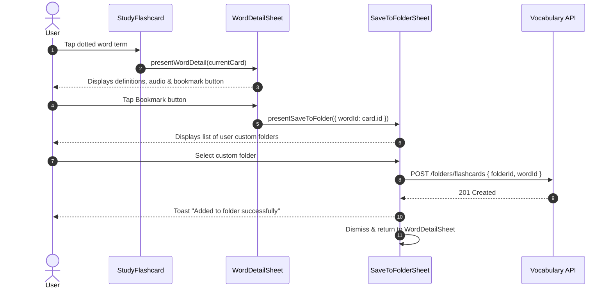

# Feature Plan: In-Study Word Detail Inspection & Custom Folder Bookmarking

> **Status**: Completed
> **Author**: Antigravity Pair Programmer / BA
> **Date**: 2026-09-21
> **Target Module**: `frontend/apps/web/src/features/study/...` & `frontend/apps/web/src/features/vocabulary/...`

---

## 1. Overview & Objectives

During flashcard study sessions and quizzes, learners frequently encounter words they want to explore more deeply (phonetics, full definitions, bilingual examples) or save directly into their personal collection for future focused review.

### Objectives:
1. **Interactive In-Study Word Detail Inspection**:
   - Make the term on flashcard screens (and study exercises) interactive with a clean, recognizable indicator (subtle dotted underline and pointer cursor).
   - Tapping the term opens `WordDetailSheet` in a stacked portal overlay without disrupting or resetting active study session state.
2. **One-Tap Bookmark to Custom Folder (`SaveToFolderSheet`)**:
   - Add a save/bookmark button in `WordDetailSheet` header.
   - Present a bottom sheet listing all user-created custom folders (`isSystem: false`).
   - Allow instant addition of the word directly into the chosen custom folder (`POST /api/v1/vocabulary/folders/flashcards` with `folderId` and `wordId`), without requiring topic categorization.
   - Support inline shortcut to create a new custom folder on the fly.

---

## 2. Requirements & Scope

### Functional Requirements

#### A. Interactive Word Detail in Flashcard Study (`StudyFlashcard` & `StudyView`)
- [x] Render the vocabulary term on `StudyFlashcard` with a dotted underline styling (`underline decoration-dotted underline-offset-4 cursor-pointer hover:text-primary transition-colors`).
- [x] On click/tap: Trigger `presentWordDetail(card)` via `@lumen/uikit/portal` (`usePortal`).
- [x] Prevent card flip event propagation when tapping the term (`event.stopPropagation()`).
- [x] Dismissing `WordDetailSheet` returns seamlessly to the active study card at the exact current position.

#### B. Bookmark / Add to Custom Folder (`SaveToFolderSheet`)
- [x] In `WordDetailSheet` header: Add a bookmark icon button (`Icons name="bookmark-plus"` or `Icons name="folder-plus"`).
- [x] Tapping the button presents `SaveToFolderSheet`.
- [x] `SaveToFolderSheet` displays:
  - Header with title: `t('saveToFolder')` and close button.
  - "Create New Folder" primary action button `t('createNewFolder')` opening `CreateFolderDialog`.
  - List of user's custom folders (`useVocabularyFolders`, filtered by `!folder.isSystem`).
  - Folder item showing folder name (`getLocalizedText(folder.name, locale)`), word count badge, and selection status.
- [x] On folder tap: Call `useCreateFlashcard({ folderId: folder.id, wordId: word.wordId || word.id })`.
- [x] Optimistic feedback: Show success toast `t('addedToFolderSuccess')` and dismiss sheet.

### Non-Functional Requirements
- **Design System Consistency**: Use standard `@lumen/uikit` surface tokens, flat aesthetic, Base UI triggers with `render`, and no manual button overrides.
- **Z-Index Portal Layering**: Stacked portal hierarchy (StudyView `zIndex=98` $\rightarrow$ WordDetailSheet `zIndex=99` $\rightarrow$ SaveToFolderSheet `zIndex=100`).
- **Strict i18n**: All copy in `messages/en.json` and `messages/vi.json` with `camelCase` keys.

### Out of Scope
- Bulk word selection during study (single word bookmarking only).

---

## 3. UI/UX Specifications (Frontend)

- **Term Trigger Styling**:
  - Dotted underline (`decoration-dotted decoration-muted-foreground/50 hover:decoration-primary`), subtle hover transition.
  - Touch-friendly hit target padding.
- **Save Action Button**:
  - Ghost icon button in sheet header (`Icons name="folder-plus"` or `"bookmark"`), size `icon-sm`.
- **Folder Picker Bottom Sheet (`SaveToFolderSheet`)**:
  - Sheet modal with clean list of user folders, radio/selection tick indicator, and empty state if no custom folders exist yet with a prompt to create one.

---

## 4. Architecture & Technical Contracts

### Interaction Sequence Diagram

---

## 5. File Change Matrix

| Action | File Path | Purpose |
| :--- | :--- | :--- |
| `[NEW]` | `frontend/apps/web/src/features/vocabulary/components/dialogs/save-to-folder-sheet.tsx` | Bottom sheet for choosing/creating custom folder to save word |
| `[MODIFY]` | `frontend/apps/web/src/features/vocabulary/components/folder-detail/word-detail-sheet.tsx` | Add save-to-folder header action and wire portal |
| `[MODIFY]` | `frontend/apps/web/src/features/study/components/study-flashcard.tsx` | Make term interactive with dotted underline and click callback |
| `[MODIFY]` | `frontend/apps/web/src/features/study/components/study-view.tsx` | Wire `presentWordDetail` portal into `StudyFlashcard` |
| `[MODIFY]` | `frontend/apps/web/src/shared/i18n/messages/en.json` | Add English i18n keys for save-to-folder flow |
| `[MODIFY]` | `frontend/apps/web/src/shared/i18n/messages/vi.json` | Add Vietnamese i18n keys for save-to-folder flow |

---

## 6. Implementation & Quality Verification Checklist

- [x] Interactive term click triggers `WordDetailSheet` without flipping card.
- [x] Sheet displays audio, translations, and examples correctly during study session.
- [x] Bookmark button opens `SaveToFolderSheet`.
- [x] Only user's custom folders (`isSystem: false`) are displayed in the list.
- [x] Direct addition to custom folder creates flashcard without requiring topics.
- [x] "Create New Folder" action works inline.
- [x] Z-index layering allows smooth dismissal back to study session.
- [x] `pnpm --filter web lint` and `pnpm --filter web build` pass with 0 errors.

---

## 7. Risks & Technical Considerations

- **Event Propagation**: Must use `event.stopPropagation()` on the term click in `StudyFlashcard` to prevent the card flip gesture from triggering at the same time.
- **Word ID Resolution**: Vocabulary cards in study sessions can have `card.wordId` or `card.id`. The bookmark payload must ensure `wordId = card.wordId || card.id` is passed correctly to the API.
