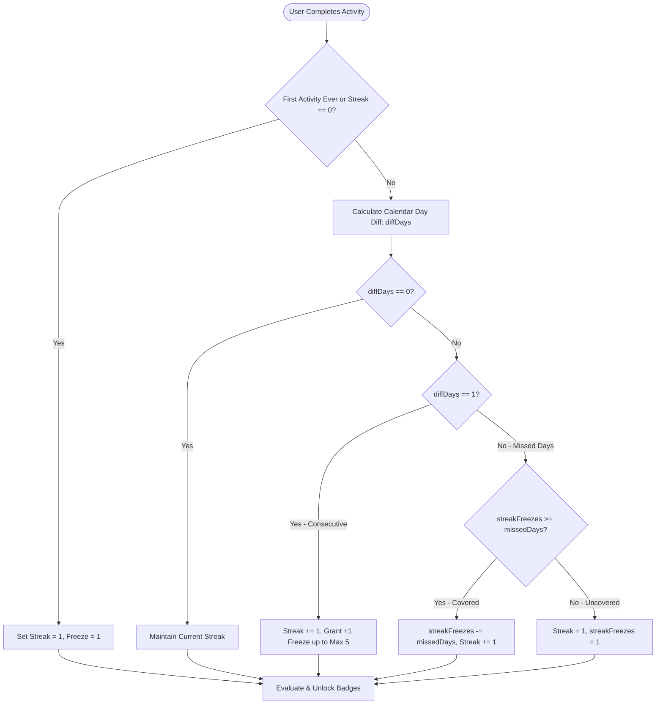

# Feature Specification: Gamification & Progress Tracking

> **Module**: `frontend/apps/web/src/features/dashboard` + `backend/src/contexts/progress`
> **Status**: Verified & Implemented
> **Author**: Antigravity Pair Programming
> **Last Updated**: 2026-09-21

---

## 1. Overview & Core Entities

Lumen incorporates a gamification and retention engine driven by the `LearningProfile` aggregate:
- **Daily Streak Tracking**: Motivates continuous daily study habits.
- **Streak Freeze Protection**: Protects streaks when users miss a study day.
- **Experience Points (XP)**: Rewarded on completing flashcards, quizzes, and study sessions.
- **Badges & Milestones**: Unlocked automatically when milestone thresholds are reached.

---

## 2. Streak Mechanics & Calculations

---

## 3. Streak Freeze Economy

- **Cap**: Maximum 5 active streak freezes per user profile.
- **Auto-Replenishment**: Users gain +1 streak freeze for maintaining consecutive day streaks.
- **Purchase with XP**: Users can buy additional streak freezes using earned points (500 XP per freeze) via `buyStreakFreeze(500)`.

---

## 4. Badge System & Thresholds

| Badge ID | Unlock Trigger | Reward / Description |
| :--- | :--- | :--- |
| `FIRST_BLOOD` | First completed study session (`totalPoints > 0`) | Welcome badge for beginning the learning journey |
| `STREAK_3_DAYS` | Reaching a 3-day continuous streak (`streak >= 3`) | Commitment badge for early consistency |
| `STREAK_7_DAYS` | Reaching a 7-day continuous streak (`streak >= 7`) | 1-Week milestone badge |
| `STREAK_30_DAYS`| Reaching a 30-day continuous streak (`streak >= 30`)| 1-Month habit mastery badge |
| `XP_1000` | Reaching 1,000 total earned points | Novice Scholar badge |
| `XP_5000` | Reaching 5,000 total earned points | Master Scholar badge |
