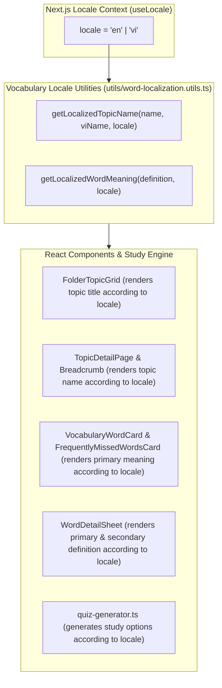

# Feature Plan: Locale-Aware Vocabulary Topics, Words & Definitions

> **Status**: Approved
> **Author**: Antigravity Pair Programmer / BA
> **Date**: 2026-09-24
> **Target Module**: `frontend/apps/web/src/features/vocabulary/...` & `frontend/apps/web/src/features/study/...`

---

## 1. Overview & Objectives

Currently, when users set their interface language to English (`/en/...`), several vocabulary UI components continue to hardcode Vietnamese strings as primary content:
- **Topic Grid Cards (`FolderTopicGrid`)**: Hardcodes Vietnamese topic name (`topicItem.viName`) as the main title (`<h4>`), putting English (`topicItem.name`) as a small subtitle under it.
- **Topic Detail & Breadcrumbs (`TopicDetailPage`)**: Hardcodes `topicViName` for breadcrumbs and study view headers even in English mode.
- **Word Cards (`VocabularyWordCard`, `FrequentlyMissedWordsCard`)**: Hardcodes `translationVi` or `definition.vi` under the word term regardless of locale.
- **Word Detail Sheet (`WordDetailSheet`)**: Always places `translationVi` in large bold text at the top and `definitionEn` below it, and always displays Vietnamese example translations under English sentences regardless of active locale.
- **Study Session Quiz Generator (`getCardPrimaryDefinition`)**: Hardcodes priority `vi` over `en` for answer options and exercise prompts (`definition.vi` -> `translationVi` -> `definitionEn` -> `definition.en`).

### Objectives:
1. **Locale-Driven Resolution Utility**: Create centralized, resilient helper functions `getLocalizedTopicName(name, viName, locale)` and `getLocalizedWordMeaning(definition, locale)` that dynamically resolve primary and secondary text based on active `locale` (`en` vs `vi`).
2. **Locale-Aware Topic Grid & Navigation**: Render English topic titles (`name`) as primary when `locale === 'en'`, and Vietnamese topic titles (`viName`) as primary when `locale === 'vi'`.
3. **Locale-Aware Word Cards & Detail Sheets**: Render `definitionEn` as primary when `locale === 'en'`, and `translationVi` as primary when `locale === 'vi'`.
4. **Locale-Aware Quiz & Study Engine**: Ensure quiz generation (`getCardPrimaryDefinition`) respects active `locale` when generating flashcard prompts and multiple-choice options.

---

## 2. Requirements & Scope

### Functional Requirements

#### A. Topic Localization Logic (`getLocalizedTopicName`)
- When `locale === 'en'`:
  - Primary title: English topic name (`topic.name`)
  - Subtitle (secondary): Vietnamese topic name (`topic.topicVi || topic.viName`)
- When `locale === 'vi'`:
  - Primary title: Vietnamese topic name (`topic.topicVi || topic.viName`)
  - Subtitle (secondary): English topic name (`topic.name`)

#### B. Word Definition Localization Logic (`getLocalizedWordMeaning`)
- When `locale === 'en'`:
  - Primary meaning: `definitionEn` -> `definition.en` -> `translationVi` -> `definition.vi`
  - Secondary meaning: `translationVi` -> `definition.vi`
- When `locale === 'vi'`:
  - Primary meaning: `translationVi` -> `definition.vi` -> `definitionEn` -> `definition.en`
  - Secondary meaning: `definitionEn` -> `definition.en`

#### C. Word Detail Sheet Layout (`WordDetailSheet`)
- When `locale === 'en'`:
  - Main bold definition: `definitionEn` (or fallback)
  - Secondary definition / translation: `translationVi`
  - Example sentence: `example.sentenceEn` in main text; `example.translationVi` in subtle secondary text.
- When `locale === 'vi'`:
  - Main bold definition: `translationVi` (or fallback)
  - Secondary definition: `definitionEn`
  - Example sentence: `example.sentenceEn` in main text; `example.translationVi` in subtle secondary text.

#### D. Study Session Quiz Generator (`quiz-generator.ts`)
- Pass active `locale` into `getCardPrimaryDefinition(card, locale)`:
  - If `locale === 'en'`: return `definitionEn` as primary.
  - If `locale === 'vi'`: return `translationVi` as primary.

### Non-Functional Requirements
- Performance: 100% pure client utilities with zero additional API latency.
- Type Safety: Full TypeScript coverage, zero `any` bypasses.
- UI Aesthetics: Preserve flat modern layout, design system compliance, zero box-in-box clutter.

---

## 3. UI/UX Specifications (Frontend)

- **Locale Hook**: Obtain active locale using `useLocale()` from `next-intl`.
- **Breadcrumb Alignment**: Page title and breadcrumbs match the active locale's topic name.
- **Card Subtitle Hierarchy**: Main heading is prominent, secondary translation/subtitle is styled with `text-muted-foreground`.

---

## 4. Architecture & Technical Contracts

---

## 5. File Change Matrix

| Action | File Path | Purpose |
| :--- | :--- | :--- |
| `[NEW]` | `frontend/apps/web/src/features/vocabulary/utils/word-localization.utils.ts` | Pure helpers `getLocalizedTopicName` & `getLocalizedWordMeaning` |
| `[MODIFY]` | `frontend/apps/web/src/features/vocabulary/utils/index.ts` | Re-export localization utilities |
| `[MODIFY]` | `frontend/apps/web/src/features/vocabulary/components/cards/vocabulary-word-card.tsx` | Use `useLocale()` and `getLocalizedWordMeaning` |
| `[MODIFY]` | `frontend/apps/web/src/features/vocabulary/components/cards/frequently-missed-words-card.tsx` | Use `useLocale()` and `getLocalizedWordMeaning` |
| `[MODIFY]` | `frontend/apps/web/src/features/vocabulary/components/folder-detail/word-detail-sheet.tsx` | Display primary and secondary definitions according to `locale` |
| `[MODIFY]` | `frontend/apps/web/src/features/vocabulary/components/folder-detail/folder-topic-grid.tsx` | Render primary topic name and subtitle according to `locale` |
| `[MODIFY]` | `frontend/apps/web/src/features/vocabulary/pages/topic-detail-page.tsx` | Localize breadcrumb and topic header by `locale` |
| `[MODIFY]` | `frontend/apps/web/src/features/study/utils/quiz-generator.ts` | Support `locale` parameter in `getCardPrimaryDefinition` |
| `[MODIFY]` | `frontend/apps/web/src/features/study/utils/__tests__/quiz-generator.spec.ts` | Unit tests for localized quiz generator |

---

## 6. Implementation & Quality Verification Checklist

- [ ] `documents/features/locale-aware-vocabulary-topics-and-definitions.md` document created.
- [ ] Create `word-localization.utils.ts` with comprehensive unit tests.
- [ ] Update `VocabularyWordCard` to use active locale.
- [ ] Update `FrequentlyMissedWordsCard` to use active locale.
- [ ] Update `WordDetailSheet` to render primary definition based on active locale.
- [ ] Update `FolderTopicGrid` to swap title and subtitle according to active locale.
- [ ] Update `TopicDetailPage` breadcrumb to use localized topic title.
- [ ] Update `getCardPrimaryDefinition` in `quiz-generator.ts` to accept `locale`.
- [ ] Run `pnpm --filter web build` to ensure 0 TypeScript compilation or linting errors.
- [ ] Verify English locale (`/en/vocabulary/folders/...`): English topic name is title, English definition is primary.
- [ ] Verify Vietnamese locale (`/vi/vocabulary/folders/...`): Vietnamese topic name is title, Vietnamese definition is primary.

---

## 7. Risks & Technical Considerations

- **Fallback Preservation**: If a word only has a Vietnamese translation or only has an English definition, the helper must fall back gracefully so no text area appears completely empty.
