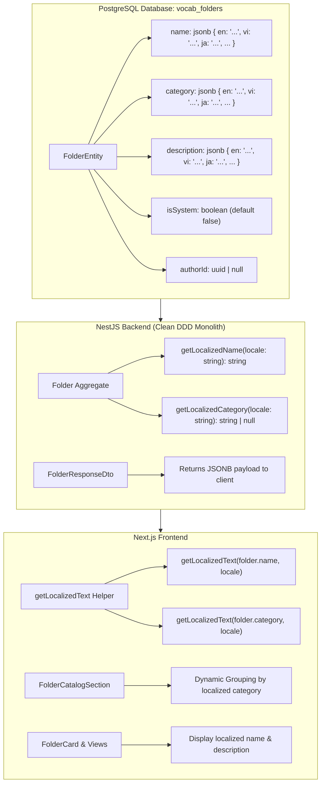

# Feature Plan: Multilingual System Folders & Categories

> **Status**: Completed
> **Author**: Antigravity Pair Programmer / BA
> **Date**: 2026-09-20
> **Target Module**: `backend/src/contexts/vocabulary/...` & `frontend/apps/web/src/features/vocabulary/...`

---

## 1. Overview & Objectives

Currently, Lumen supports bilingual user interface localization (English and Vietnamese via `next-intl`). However, system-curated folder names (e.g., *"600 từ vựng TOEIC"*), descriptions, and category collection headers (e.g., *"Từ vựng TOEIC"*) are stored as single static strings in the database. When users switch the application language to English, these system folders and category titles remain in Vietnamese.

### Objectives:
1. **Scalable JSONB Schema (`I18nString`)**: Store all localized field values in JSONB columns (`name`, `category`, `description`) as structured key-value maps (`{ "en": "...", "vi": "..." }`) rather than creating separate rigid columns (`nameEn`, `nameVi`). This allows future language expansion (e.g., `ja`, `ko`, `zh`, `fr`, `de`, `es`) without requiring database schema migrations or code refactoring.
2. **System Folders & Categories (`isSystem: true`)**: Persist multi-language maps in JSONB format. Automatically resolve and render the appropriate language according to the user's active `locale`.
3. **Custom User Folders (`isSystem: false`)**: Maintain 100% fidelity for user-generated content (UGC). Custom folder names created by users are preserved verbatim without machine translation. The folder group header for user folders is dynamically localized via i18n message catalogs (`t('myFolders')` $\rightarrow$ *"My Folders"* / *"Thư mục của tôi"*).
4. **Universal Multi-Language Resolution Standard**: Provide a unified, resilient resolution algorithm across both backend and frontend layers that gracefully falls back across language tiers.

---

## 2. Requirements & Scope

### Functional Requirements

#### A. Multilingual Data Structure & Strict Typing (`SupportedLocale` & `I18nString`)
- Schema format:
```typescript
export type SupportedLocale = 'en' | 'vi'; // Expandable to 'ja' | 'ko' | 'zh' ...
export type I18nMap = Partial<Record<SupportedLocale, string>>;
export type I18nString = I18nMap | string;
```
- JSONB Payload Example:
```json
{
  "en": "600 Essential TOEIC Words",
  "vi": "600 từ vựng TOEIC"
}
```

#### B. Folder Domain Classification
- [x] Explicit `isSystem: boolean` attribute (defaults to `false` for user-created custom folders; `true` for platform-curated system folders).
- [x] `authorId: string | null` (`null` or system UUID for system folders, user UUID for custom folders).

#### C. System Folder Localization (`isSystem: true`)
- [x] **Folder Name (`name`)**: JSONB format containing localized names for supported languages (`en`, `vi`, and expandable to others).
- [x] **Description (`description`)**: JSONB format containing localized descriptions.
- [x] **Category (`category`)**: JSONB format containing localized category titles (e.g., `{ "en": "TOEIC Vocabulary", "vi": "Từ vựng TOEIC" }`).

#### D. Custom User Folder Handling (`isSystem: false`)
- [x] Store user-entered text verbatim (either as string or single-language map).
- [x] Display section header and subtitle using centralized i18n keys:
  - `en`: "My Folders" / "Vocabulary folders created by you"
  - `vi`: "Thư mục của tôi" / "Các thư mục từ vựng do bạn tự tạo"

#### E. Language Resolution & Fallback Algorithm
When resolving any `I18nString` for a requested `targetLocale`:
1. **Direct Match**: Check if `value[targetLocale]` exists and is non-empty. If so, return it.
2. **Default System Fallback (`en`)**: If not found, check `value['en']`.
3. **Secondary Fallback (`vi`)**: If English is missing, check `value['vi']`.
4. **First Available Key**: Return the first non-empty value present in the JSONB object (e.g. `Object.values(value)[0]`).
5. **Fallback Default**: If the object is empty or `null`/`undefined`, return the provided default string or empty string `""`.

---

## 3. UI/UX Specifications (Frontend)

- **Design System Alignment**: Standard flat cards (`rounded-3xl border-none bg-card shadow-sm`), no box-in-box card nesting.
- **Dynamic Grouping**: The `FolderCatalogSection` dynamically groups system folders by their localized category title: `getLocalizedText(folder.category, currentLocale)`.
- **Pure Helpers**: Centralized pure localization helper `getLocalizedText(value, locale, fallbackLocale)` under `features/vocabulary/utils/folder-localization.utils.ts`.
- **i18n Messages**: Catalog messages in `messages/en.json` and `messages/vi.json` for all fixed section labels.

---

## 4. Architecture & Technical Contracts

### Database Architecture: JSONB Localized Field Schema



### Backend Contracts (`backend/src/contexts/vocabulary`)
- **Entity**: `FolderEntity` with `name`, `category`, `description` typed as `jsonb`, plus `isSystem: boolean`.
- **Aggregate**: `Folder` domain aggregate encapsulating `I18nString` values with localization helper methods.
- **Repository**: `FolderRepository` mapping between JSONB columns and `Folder` aggregate.
- **Seed Data**: `vocabulary-data.ts` containing bilingual maps for all system folders and categories.

### Frontend Contracts (`frontend/apps/web/src/features/vocabulary`)
- **Types**: `I18nString = Record<string, string> | string` in `vocabulary.types.ts`.
- **Pure Utility**: `getLocalizedText(value: I18nString | null | undefined, locale?: string, fallback?: string): string`.
- **Components**: `FolderCatalogSection`, `FolderCard`, `CurrentLearningFolderCard`, `SwitchFolderDialog`, and `FolderDetailPage`.

---

## 5. Guidelines for Future Multilingual Database Extensions

For any future entities requiring multi-language support (e.g. `topics`, `grammar_points`, `questions`, `badges`, etc.):

1. **Schema Standard**:
   - Always use `type: 'jsonb'` with a default value of `{}` in TypeORM entities.
   - Field naming should remain generic (e.g. `title`, `description`, `label`, `category`), NEVER append language suffixes (`title_en`, `title_vi`).
   - Domain types should use `I18nString = Record<string, string> | string`.

2. **Adding New Languages**:
   - Zero database migrations required when adding a new language (e.g. Japanese `ja`, Korean `ko`, Chinese `zh`, French `fr`).
   - To add translations for existing records: simply update or merge keys into the JSONB column:
     ```sql
     UPDATE vocab_folders
     SET name = jsonb_set(name, '{ja}', '"TOEIC必須単語600"')
     WHERE id = '...';
     ```
   - On the frontend, add the new locale to routing / `next-intl` configuration without altering data models.

3. **Database Indexing for JSONB (Optional Performance Optimization)**:
   - If querying or filtering entities by localized fields in specific languages becomes necessary in the future:
     ```sql
     -- Indexing for specific language lookup
     CREATE INDEX idx_vocab_folders_name_en ON vocab_folders ((name->>'en'));
     
     -- General JSONB GIN index for full key-value search
     CREATE INDEX idx_vocab_folders_name_gin ON vocab_folders USING gin (name);
     ```

---

## 6. File Change Matrix

| Action | File Path | Purpose |
| :--- | :--- | :--- |
| `[MODIFY]` | `backend/src/contexts/vocabulary/infrastructure/entities/folder.entity.ts` | Update columns to `jsonb` & add `isSystem` |
| `[MODIFY]` | `backend/src/contexts/vocabulary/domain/aggregates/folder.aggregate.ts` | Support `I18nString` & localization helpers |
| `[MODIFY]` | `backend/src/contexts/vocabulary/infrastructure/repositories/folder.repository.ts` | Map JSONB attributes to/from aggregate |
| `[MODIFY]` | `backend/src/contexts/vocabulary/application/dtos/folder.response.dto.ts` | Support `I18nString` in API response |
| `[MODIFY]` | `backend/src/seed-toeic.ts` | Bilingual system folder seed data |
| `[MODIFY]` | `frontend/apps/web/src/services/vocabulary/vocabulary.types.ts` | Update `Folder` type with `I18nString` & `isSystem` |
| `[NEW]` | `frontend/apps/web/src/features/vocabulary/utils/folder-localization.utils.ts` | Pure `getLocalizedText` helper function |
| `[MODIFY]` | `frontend/apps/web/src/features/vocabulary/components/cards/folder-catalog-section.tsx` | Dynamic grouping by localized category |
| `[MODIFY]` | `frontend/apps/web/src/features/vocabulary/components/cards/folder-card.tsx` | Render localized folder name and description |
| `[MODIFY]` | `frontend/apps/web/src/features/vocabulary/components/cards/current-learning-folder-card.tsx` | Render localized name for active pinned folder |

---

## 7. Implementation & Quality Verification Checklist

- [x] Backend Type Check: `pnpm tsc --noEmit` passes with 0 errors.
- [x] Frontend Type Check: `pnpm --filter web build` passes with 0 errors.
- [x] Lint Check: `eslint` passes on all modified backend and frontend files.
- [x] Build Verification: `nest build` and `next build` succeed without regressions.
- [x] Vietnamese view (`/vi/vocabulary/folders`): Displays "Từ vựng TOEIC" and "600 từ vựng TOEIC".
- [x] English view (`/en/vocabulary/folders`): Displays "TOEIC Vocabulary" and "600 Essential TOEIC Words".
- [x] Custom user folders maintain exact original user text across all locales.

---

## 8. Risks & Technical Considerations

- **Backward Compatibility**: Existing database records with string values in `name` or `category` must be safely handled by `getLocalizedText` (if value is string, return directly; if object, access key `[locale]`).
- **PostgreSQL JSONB Compatibility**: Use TypeORM `@Column({ type: 'jsonb', default: {} })` which handles JSON serialization automatically.
