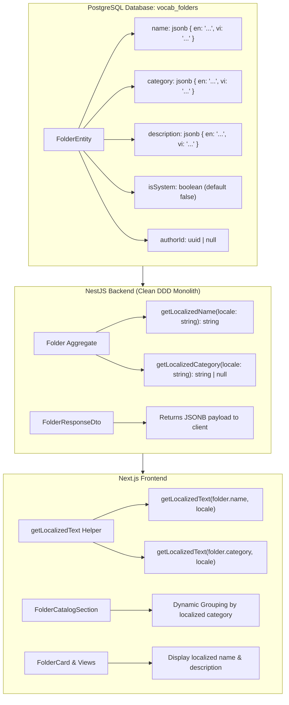

# Feature Plan: Multilingual System Folders & Categories

> **Status**: In Review
> **Author**: Antigravity Pair Programmer / BA
> **Date**: 2026-09-20
> **Target Module**: `backend/src/contexts/vocabulary/...` & `frontend/apps/web/src/features/vocabulary/...`

---

## 1. Overview & Objectives

Currently, Lumen supports bilingual user interface localization (English and Vietnamese via `next-intl`). However, system-curated folder names (e.g., *"600 từ vựng TOEIC"*), descriptions, and category collection headers (e.g., *"Từ vựng TOEIC"*) are stored as single static strings in the database. When users switch the application language to English, these system folders and category titles remain in Vietnamese.

### Objectives:
1. **Scalable JSONB Schema (`I18nString`)**: Store all localized field values in JSONB columns (`name`, `category`, `description`) as structured key-value maps (`{ "en": "...", "vi": "..." }`) rather than creating separate rigid columns (`nameEn`, `nameVi`). This allows future language expansion (e.g., `ja`, `ko`, `zh`, `fr`) without database schema migrations.
2. **System Folders & Categories (`isSystem: true`)**: Persist multi-language maps in JSONB format. Automatically resolve and render the appropriate language according to the user's active `locale`.
3. **Custom User Folders (`isSystem: false`)**: Maintain 100% fidelity for user-generated content (UGC). Custom folder names created by users are preserved verbatim without machine translation. The folder group header for user folders is dynamically localized via i18n message catalogs (`t('myFolders')` $\rightarrow$ *"My Folders"* / *"Thư mục của tôi"*).

---

## 2. Requirements & Scope

### Functional Requirements

#### A. Multilingual Data Structure (`I18nString`)
- Schema format: `Record<string, string> | string`
```json
{
  "en": "600 Essential TOEIC Words",
  "vi": "600 từ vựng TOEIC"
}
```

#### B. Folder Domain Classification
- [ ] Explicit `isSystem: boolean` attribute (defaults to `false` for user-created custom folders; `true` for platform-curated system folders).
- [ ] `authorId: string | null` (`null` or system UUID for system folders, user UUID for custom folders).

#### C. System Folder Localization (`isSystem: true`)
- [ ] **Folder Name (`name`)**: JSONB format containing localized names for supported languages (`en`, `vi`).
- [ ] **Description (`description`)**: JSONB format containing localized descriptions.
- [ ] **Category (`category`)**: JSONB format containing localized category titles (e.g., `{ "en": "TOEIC Vocabulary", "vi": "Từ vựng TOEIC" }`).

#### D. Custom User Folder Handling (`isSystem: false`)
- [ ] Store user-entered text verbatim (either as string or single-language map).
- [ ] Display section header and subtitle using centralized i18n keys:
  - `en`: "My Folders" / "Vocabulary folders created by you"
  - `vi`: "Thư mục của tôi" / "Các thư mục từ vựng do bạn tự tạo"

---

## 3. UI/UX Specifications (Frontend)

- **Design System Alignment**: Standard flat cards (`rounded-3xl border-none bg-card shadow-sm`), no box-in-box card nesting.
- **Dynamic Grouping**: The `FolderCatalogSection` dynamically groups system folders by their localized category title: `getLocalizedText(folder.category, currentLocale)`.
- **Pure Helpers**: Centralized pure localization helper `getLocalizedText(value, locale, fallbackLocale)` under `features/vocabulary/utils/`.
- **i18n Messages**: Catalog messages in `messages/en.json` and `messages/vi.json` for all fixed section labels.

---

## 4. Architecture & Technical Contracts

### Database Architecture: JSONB Localized Field Schema



### Backend Contracts (`backend/src/contexts/vocabulary`)
- **Entity**: `FolderEntity` with `name`, `category`, `description` typed as `jsonb`, plus `isSystem: boolean`.
- **Aggregate**: `Folder` domain aggregate encapsulating `I18nString` values with localization helper methods.
- **Repository**: `FolderRepository` mapping between JSONB columns and `Folder` aggregate.
- **Seed Data**: `vocabulary-data.ts` containing bilingual maps for all system folders and categories.

### Frontend Contracts (`frontend/apps/web/src/features/vocabulary`)
- **Types**: `I18nString = Record<string, string> | string` in `vocabulary.types.ts`.
- **Pure Utility**: `getLocalizedText(value: I18nString | null | undefined, locale?: string, fallback?: string): string`.
- **Components**: `FolderCatalogSection`, `FolderCard`, `CurrentLearningFolderCard`, `SwitchFolderDialog`, and `FolderDetailPage`.

---

## 5. File Change Matrix

| Action | File Path | Purpose |
| :--- | :--- | :--- |
| `[MODIFY]` | `backend/src/contexts/vocabulary/infrastructure/entities/folder.entity.ts` | Update columns to `jsonb` & add `isSystem` |
| `[MODIFY]` | `backend/src/contexts/vocabulary/domain/aggregates/folder.aggregate.ts` | Support `I18nString` & localization helpers |
| `[MODIFY]` | `backend/src/contexts/vocabulary/infrastructure/repositories/folder.repository.ts` | Map JSONB attributes to/from aggregate |
| `[MODIFY]` | `backend/src/contexts/vocabulary/application/dtos/folder.response.dto.ts` | Support `I18nString` in API response |
| `[MODIFY]` | `backend/src/seed/vocabulary-data.ts` | Bilingual system folder seed data |
| `[MODIFY]` | `frontend/apps/web/src/services/vocabulary/vocabulary.types.ts` | Update `Folder` type with `I18nString` & `isSystem` |
| `[NEW]` | `frontend/apps/web/src/features/vocabulary/utils/folder-localization.utils.ts` | Pure `getLocalizedText` helper function |
| `[MODIFY]` | `frontend/apps/web/src/features/vocabulary/components/cards/folder-catalog-section.tsx` | Dynamic grouping by localized category |
| `[MODIFY]` | `frontend/apps/web/src/features/vocabulary/components/cards/folder-card.tsx` | Render localized folder name and description |
| `[MODIFY]` | `frontend/apps/web/src/features/vocabulary/components/cards/current-learning-folder-card.tsx` | Render localized name for active pinned folder |

---

## 6. Implementation & Quality Verification Checklist

- [ ] Backend Type Check: `pnpm --filter backend exec tsc --noEmit` passes with 0 errors.
- [ ] Frontend Type Check: `pnpm --filter web exec tsc --noEmit` passes with 0 errors.
- [ ] Lint Check: `eslint` passes on all modified backend and frontend files.
- [ ] Build Verification: `nest build` and `next build` succeed without regressions.
- [ ] Vietnamese view (`/vi/vocabulary/folders`): Displays "Từ vựng TOEIC" and "600 từ vựng TOEIC".
- [ ] English view (`/en/vocabulary/folders`): Displays "TOEIC Vocabulary" and "600 Essential TOEIC Words".
- [ ] Custom user folders maintain exact original user text across all locales.

---

## 7. Risks & Technical Considerations

- **Backward Compatibility**: Existing database records with string values in `name` or `category` must be safely handled by `getLocalizedText` (if value is string, return directly; if object, access key `[locale]`).
- **PostgreSQL JSONB Compatibility**: Use TypeORM `@Column({ type: 'jsonb', default: {} })` which handles JSON serialization automatically.
