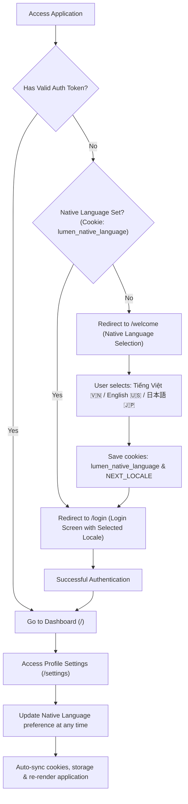

# Feature Specification: Native Language Onboarding & Multi-Language Support

## 1. Context & Objectives

For a language learning platform like Lumen, first-time visitors arrive without prior personal data or user accounts. To deliver an optimal personalized onboarding experience:

1. **First-time Visitor Onboarding**: The system presents a **Native Language Selection** screen (`/welcome`) before directing users to the login screen (`/login`).
2. **Japanese Language (`ja`) Support**: Expand the internationalization ecosystem to include Japanese (`ja`) alongside Vietnamese (`vi`) and English (`en`).
3. **Profile Settings**: Update the profile setting to **"Native Language"**, allowing users to change their preference anytime with automatic synchronization to cookies, local storage, and profile backend.

---

## 2. User Flow

---

## 3. Technical Specifications

### 3.1. Cross-Platform Storage Strategy (Web & Mobile Compatibility)

To ensure **100% architectural compatibility across Web and Mobile Apps (React Native/Flutter/iOS/Android)** without hard coupling to browser cookies:

1. **Client Storage Layer (Local Storage)**:
   - **Web**: Uses `localStorage` with standard key `lumen_native_language`. Simultaneously mirrors to a lightweight cookie for Next.js Server-Side Middleware (Edge runtime).
   - **Mobile**: Uses `AsyncStorage` / `SecureStore` / `SharedPreferences` with the same key `lumen_native_language`. Mobile requires no cookie dependencies.
2. **API Communication Layer (Request Headers)**:
   - Both Web and Mobile send a standard header on all HTTP requests to the NestJS backend:
     `api-language: vi | en | ja` (or `Accept-Language: vi | en | ja`).
3. **User Profile Synchronization (Backend Sync)**:
   - Upon successful authentication, the `nativeLanguage` profile field synchronizes bidirectionally:
     - If the user changes language locally $\rightarrow$ triggers profile update API.
     - When logging in on a new device (Web or Mobile) $\rightarrow$ automatically loads preference from user profile.

### 3.2. Centralized Route Grouping

Routes are strictly categorized in `src/shared/constants/route.ts`:

- **`ONBOARDING_ROUTES = [RouteEnum.WELCOME]`**: Welcome and initial survey screens for first-time visitors.
- **`PUBLIC_ROUTES = [RouteEnum.LOGIN, RouteEnum.WELCOME]`**: Public endpoints accessible without authentication tokens.
- **`APP_PROTECTED_ROUTES = [...]`**: Authenticated app routes (Dashboard, Study, Vocabulary, Settings...).

### 3.3. Routing & i18n Configuration

- **`src/shared/i18n/routing.ts`**:
  - `locales`: `['en', 'vi']`
  - `defaultLocale`: `'vi'`
- **`src/shared/i18n/messages/`**:
  - `vi.json`: Contains `Settings.appearance.nativeLanguage` and `Auth.Welcome`.
  - `en.json`: Contains `Settings.appearance.nativeLanguage` and `Auth.Welcome`.

### 3.4. Welcome Screen (`/welcome`)

- **Route**: `RouteEnum.WELCOME = '/welcome'`.
- **UI Architecture**:
  - Encapsulated inside the auth layout featuring Lumen brand WebGL/canvas accents.
  - Multi-lingual Header:
    - _Tiếng Việt_: "Chào mừng bạn đến với Lumen. Hãy chọn ngôn ngữ mẹ đẻ của bạn để bắt đầu."
    - _English_: "Welcome to Lumen. Choose your native language to get started."
    - _日本語_: "Lumenへようこそ。母国語を選択して始めましょう。"
  - Language Selection Card Grid:
    1. 🇻🇳 **Tiếng Việt** (Vietnamese)
    2. 🇺🇸 **English** (English)
    3. 🇯🇵 **日本語** (Japanese)
  - Action Button: `[ Tiếp tục / Continue / 次へ ]` navigating to `/login`.

### 3.5. Edge Middleware (`src/middleware.ts`)

- References `PUBLIC_ROUTES` directly from `route.ts`.
- Routing Evaluation:
  - If `!token && !nativeLanguage && !ONBOARDING_ROUTES.includes(normalizedPath)`: Redirect to `/welcome`.
  - If `token && ONBOARDING_ROUTES.includes(normalizedPath)`: Redirect to `/` (dashboard).
  - If `!token && normalizedPath === '/' && nativeLanguage`: Redirect to `/login`.

### 3.6. Settings Page Updates (`/settings`)

- Updates `appearance.language` label to **"Native Language" / "Ngôn ngữ mẹ đẻ" / "母国語"**.
- Updates `LanguageSwitcher` to support flag 🇯🇵 and "日本語" label.
- Switching language in `LanguageSwitcher` automatically updates `lumen_native_language` in local storage and request headers.
