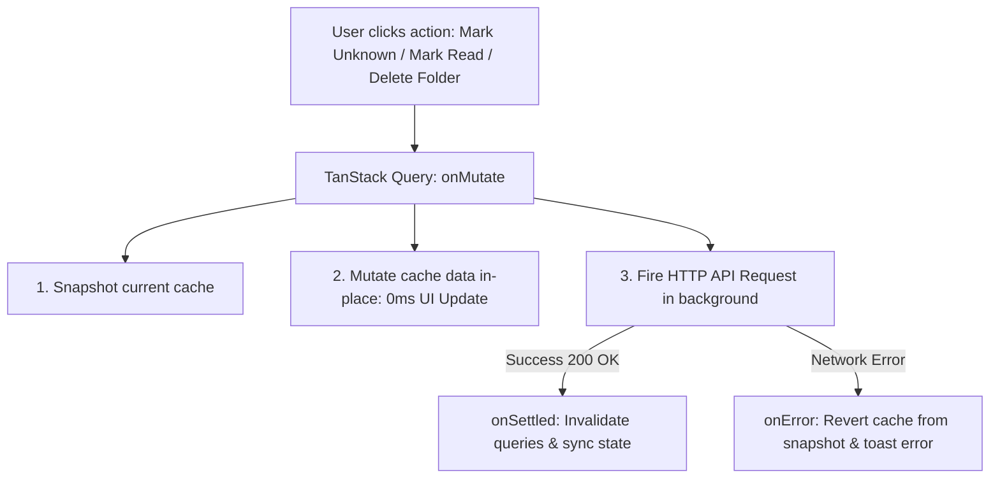

# Feature Plan: Optimistic UI Updates & Instant Cache Mutations

> **Status**: Completed
> **Author**: Antigravity Pair Programmer / BA
> **Date**: 2026-09-20
> **Target Module**: `frontend/apps/web/src/features/...` (`study`, `vocabulary`, `notification`)

---

## 1. Overview & Objectives

In modern web applications, waiting for network roundtrips (300ms–1000ms+) before updating UI elements creates a sluggish experience and leads to edge-case bugs when users perform rapid interactions (e.g. clicking a status button and immediately dismissing a modal).

This feature plan establishes standard **Optimistic UI Updates** across core user workflows in Lumen using TanStack Query cache mutations.

### Key Enhancement Areas:
1. **Flashcard Mastery Toggles (`useReviewFlashcard`)**:
   - Marking a word as "Unknown" (`level: 0`, `learningStep: 0`) or "Known" (`level: 6`) immediately reflects on all background word cards, lists, and badge counters in 0ms.
   - Eliminates the issue where rapidly closing `WordDetailSheet` gives the appearance of an aborted update.
2. **Notification Status (`useMarkAsRead`, `useMarkAllAsRead`)**:
   - Marking single or all notifications as read immediately clears unread badges and highlighted indicators without waiting for API response.
3. **Folder Management (`useDeleteFolder`)**:
   - Deleting a folder instantly removes the card from the UI grid with zero lag.
4. **Resilient Error Rollback**:
   - All optimistic mutations snapshot previous query cache and roll back cleanly with error toasts if the server request fails.

---

## 2. Requirements & Scope

### Functional Requirements

#### A. Single Flashcard Review Optimistic Mutation (`useReviewFlashcard`)
- [x] Cancel in-flight queries matching `vocabularyKeys.all` and `studyKeys.all`.
- [x] Snapshot query data for rollback.
- [x] Optimistically update cached items matching `flashcardId` / `wordId` across:
  - `vocabularyKeys.folderFlashcards(folderId, topic)`
  - `studyKeys.dueFlashcards()`
- [x] Update fields:
  - If `isResetToUnlearned`: `level = 0`, `learningStep = 0`, `isWilted = false`.
  - If `isFastTrackKnown`: `level = 6`, `learningStep = 6`, `isWilted = false`.
- [x] Rollback on `onError`.
- [x] Resync on `onSettled`.

#### B. Notification Optimistic Mutations (`use-notification.ts`)
- [x] `useMarkAsRead`: Optimistically set `read = true` for target notification ID in `notificationKeys.all`.
- [x] `useMarkAllAsRead`: Optimistically set `read = true` for all notifications in `notificationKeys.all`.
- [x] Rollback on `onError`.

#### C. Folder Deletion Optimistic Mutation (`use-vocabulary.ts`)
- [x] `useDeleteFolder`: Optimistically filter out the target folder from `vocabularyKeys.folders()`.
- [x] Rollback on `onError`.

---

## 3. UI/UX Specifications (Frontend)

- **0ms Perceived Latency**: All user actions update visual state instantly.
- **Safe Modal Dismissal**: Users can close sheets or modals immediately after tapping an action without fear of data loss or incomplete state.
- **Visual Error Recovery**: If an error occurs, the UI smoothly reverts to the prior snapshot and presents an error toast.

---

## 4. Architecture & Technical Contracts

---

## 5. File Change Matrix

| Action | File Path | Purpose |
| :--- | :--- | :--- |
| `[MODIFY]` | `frontend/apps/web/src/features/study/hooks/use-study.ts` | Optimistic cache update for `useReviewFlashcard` |
| `[MODIFY]` | `frontend/apps/web/src/features/notification/hooks/use-notification.ts` | Optimistic cache update for `useMarkAsRead` and `useMarkAllAsRead` |
| `[MODIFY]` | `frontend/apps/web/src/features/vocabulary/hooks/use-vocabulary.ts` | Optimistic cache update for `useDeleteFolder` |

---

## 6. Implementation & Quality Verification Checklist

- [x] `useReviewFlashcard` updates `folderFlashcards` cache instantly (0ms).
- [x] `useMarkAsRead` and `useMarkAllAsRead` update `notifications` cache instantly (0ms).
- [x] `useDeleteFolder` updates `folders` cache instantly (0ms).
- [x] Rollback snapshots verified on error scenarios.
- [x] `pnpm --filter web lint` passes with 0 errors.
- [x] `pnpm --filter web build` passes with 0 errors.

---

## 7. Risks & Technical Considerations

- **Cache Data Structure Handling**: Ensure all updater functions check for existing cache data safely (e.g. `Array.isArray` or `{ data: [...] }`) before applying updates to prevent runtime crashes when cache is uninitialized.
