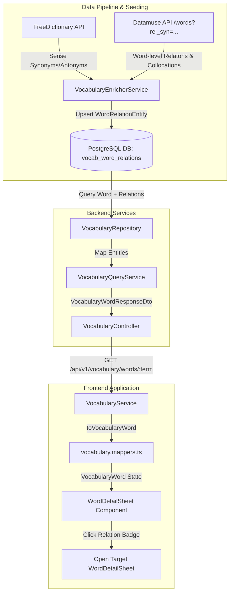

# Feature Specification & Architecture Plan: Lexical Relations (Synonyms, Antonyms & Related Words)

> **Status**: Ready for Implementation  
> **Author**: Antigravity Pair Programmer / Business Analyst (BA)  
> **Date**: 2026-10-01  
> **Target Modules**: `backend/src/contexts/vocabulary` & `frontend/apps/web/src/features/vocabulary`  
> **Document Location**: `documents/features/synonyms-and-antonyms.md`

---

## 1. Overview & Business Objectives

In natural language learning, vocabulary terms do not exist in isolation. Acquiring a word alongside its **Synonyms (Từ đồng nghĩa)**, **Antonyms (Từ trái nghĩa)**, and **Related Words / Collocations (Các từ liên quan)** significantly boosts reading comprehension, contextual expression, and long-term memory retention.

### Core Objectives
1. **Sense-Level & Word-Level Relations**: Support both sense-specific relations (e.g., definition #1 "cheap" has synonym "inexpensive") and word-level relations (e.g. collocations/compounds like "budgeting", "budget for", "budget deficit").
2. **Relational Graph Architecture**: Implement a normalized relational entity table (`vocab_word_relations`) instead of flat JSONB arrays. This enables bidirectional indexing, relational foreign keys, and $O(1)$ query lookups.
3. **Interactive Navigation Graph**: Every relation badge rendered in the UI is interactive—clicking a badge seamlessly opens the `WordDetailSheet` for that target term.
4. **Automated Seeding & Data Pipeline Integration**: Extend `VocabularyEnricherService` to automatically fetch lexical relations from external APIs (Datamuse & FreeDictionary) and link existing master terms in PostgreSQL.

---

## 2. Architectural Decision Record (ADR)

### Context & Problem Statement
Should lexical relations (synonyms, antonyms, related words) be stored as flat JSONB arrays (e.g. `["cheap", "inexpensive"]`) within `vocab_definitions` / `vocab_words`, or as a dedicated relational entity table (`vocab_word_relations`)?

### Decision: Dedicated Relational Table (`vocab_word_relations`)

| Evaluation Criteria | Option A: Flat JSONB Arrays | Option B: Relational Entity (`vocab_word_relations`) |
| :--- | :--- | :--- |
| **Interactive Navigation** | Requires string matching queries at runtime. Cannot store target word UUID references. | Statically links `targetWordId` for immediate lookup without re-querying string indices. |
| **Sense-Level vs Word-Level** | Inflexible; requires duplicating JSON arrays across definitions. | FK `definitionId` is optional: nullable for word-level collocations, set for definition-specific synonyms. |
| **Bidirectional Traversal** | Expensive `$[]` JSON searches in PostgreSQL (`jsonb_array_elements`). | Standard SQL indexing on `sourceWordId`, `targetWordId`, and `definitionId`. |
| **Data Integrity** | Cascade deletes or word renaming breaks text strings. | Foreign Keys (`ON DELETE CASCADE`, `ON DELETE SET NULL`) enforce referential integrity. |

**Conclusion**: Option B (`vocab_word_relations`) provides superior query performance, strict data integrity, and seamless UI badge navigation.

---

## 3. System Architecture & Data Flow



---

## 4. Requirements & Scope

### Functional Requirements

#### 1. Relational Database Modeling (`vocab_word_relations`)
- Create `WordRelationEntity` mapped to PostgreSQL table `vocab_word_relations`.
- Support three distinct relation types via `WordRelationType` enum:
  - `SYNONYM`: Words with identical or nearly identical meanings.
  - `ANTONYM`: Words with opposite meanings.
  - `RELATED`: Collocations, phrasal verbs, word family forms, or related compounds (e.g. `budget deficit`, `low-budget`).
- Support sense-level binding (`definitionId` IS NOT NULL) for definition-specific synonyms/antonyms.
- Support word-level binding (`definitionId` IS NULL) for general collocations and compound phrases.

#### 2. Backend DTO & Serialization Layer
- Expose structured `relations: WordRelationResponseDto[]` in `VocabularyWordResponseDto` and `VocabularyDefinitionResponseDto`.
- Enforce zero `any` types and proper `@Expose()` and `@Type()` class-transformer decorators.

#### 3. Automated Seeding & Enrichment Engine
- Update `VocabularyEnricherService` to extract synonyms/antonyms from FreeDictionary responses and fetch collocations/related terms from Datamuse API (`https://api.datamuse.com/words?rel_syn=...`, `rel_ant=...`, `rel_trg=...`).
- Auto-link `targetWordId` when `targetTerm` matches an existing record in `vocab_words`.

#### 4. Frontend Types & Service Mappers
- Define `WordRelationType` enum and `WordRelation` interface in `@/services/vocabulary/vocabulary.types.ts`.
- Implement `toWordRelation` mapper in `@/services/vocabulary/vocabulary.mappers.ts`.

#### 5. Interactive UI Component (`WordDetailSheet`)
- Display **Từ đồng nghĩa (Synonyms)** badges under corresponding definition blocks.
- Display **Từ trái nghĩa (Antonyms)** badges under corresponding definition blocks.
- Display **Các từ liên quan (Related Words)** section in `WordDetailSheet`.
- Badges MUST use design system `<Badge variant="subtle" size="sm">` with hover feedback and cursor-pointer.
- Clicking any relation badge inspects that term by triggering `onSelectWord(targetTerm)`.

#### 6. i18n Localization
- Add `synonyms`, `antonyms`, and `relatedWords` translation keys to `messages/en.json` and `messages/vi.json`.

---

## 5. Technical Contracts & Database Schemas

### 1. Database DDL Migration (`vocab_word_relations`)

```sql
-- 1. Create Enum Type
CREATE TYPE word_relation_type_enum AS ENUM ('SYNONYM', 'ANTONYM', 'RELATED');

-- 2. Create Relational Table
CREATE TABLE vocab_word_relations (
    id UUID PRIMARY KEY DEFAULT gen_random_uuid(),
    "sourceWordId" UUID NOT NULL REFERENCES vocab_words(id) ON DELETE CASCADE,
    "definitionId" UUID REFERENCES vocab_definitions(id) ON DELETE CASCADE,
    "targetWordId" UUID REFERENCES vocab_words(id) ON DELETE SET NULL,
    "targetTerm" VARCHAR(255) NOT NULL,
    "relationType" word_relation_type_enum NOT NULL DEFAULT 'RELATED',
    "displayOrder" INT NOT NULL DEFAULT 0,
    created_at TIMESTAMP NOT NULL DEFAULT NOW(),
    updated_at TIMESTAMP NOT NULL DEFAULT NOW()
);

-- 3. Create Indices for Performance Lookups
CREATE INDEX idx_word_relation_source ON vocab_word_relations("sourceWordId");
CREATE INDEX idx_word_relation_definition ON vocab_word_relations("definitionId");
CREATE INDEX idx_word_relation_target_term ON vocab_word_relations("targetTerm");
CREATE UNIQUE INDEX idx_word_relation_unique 
ON vocab_word_relations ("sourceWordId", COALESCE("definitionId", '00000000-0000-0000-0000-000000000000'), "targetTerm", "relationType");
```

---

### 2. TypeORM Entities (`backend/src/contexts/vocabulary/infrastructure/entities/`)

#### `word-relation.entity.ts`
```typescript
import { Column, Entity, Index, JoinColumn, ManyToOne } from 'typeorm';
import { BaseEntity } from '../../../../shared/infrastructure/database/base.entity';
import { DefinitionEntity } from './definition.entity';
import { WordEntity } from './word.entity';

export enum WordRelationType {
  SYNONYM = 'SYNONYM',
  ANTONYM = 'ANTONYM',
  RELATED = 'RELATED',
}

@Entity('vocab_word_relations')
@Index('idx_word_relation_source', ['sourceWordId'])
@Index('idx_word_relation_definition', ['definitionId'])
@Index('idx_word_relation_target_term', ['targetTerm'])
export class WordRelationEntity extends BaseEntity {
  @Column({ type: 'uuid' })
  sourceWordId: string;

  @Column({ type: 'uuid', nullable: true })
  definitionId: string | null;

  @Column({ type: 'uuid', nullable: true })
  targetWordId: string | null;

  @Column()
  targetTerm: string;

  @Column({
    type: 'enum',
    enum: WordRelationType,
    default: WordRelationType.RELATED,
  })
  relationType: WordRelationType;

  @Column({ type: 'int', default: 0 })
  displayOrder: number;

  @ManyToOne(() => WordEntity, (word) => word.relations, { onDelete: 'CASCADE' })
  @JoinColumn({ name: 'sourceWordId' })
  sourceWord: WordEntity;

  @ManyToOne(() => DefinitionEntity, (def) => def.relations, {
    onDelete: 'CASCADE',
    nullable: true,
  })
  @JoinColumn({ name: 'definitionId' })
  definition: DefinitionEntity | null;

  @ManyToOne(() => WordEntity, { onDelete: 'SET NULL', nullable: true })
  @JoinColumn({ name: 'targetWordId' })
  targetWord: WordEntity | null;
}
```

#### Updated `word.entity.ts` & `definition.entity.ts`
- In `WordEntity`:
  ```typescript
  @OneToMany(() => WordRelationEntity, (relation) => relation.sourceWord)
  relations: WordRelationEntity[];
  ```
- In `DefinitionEntity`:
  ```typescript
  @OneToMany(() => WordRelationEntity, (relation) => relation.definition)
  relations: WordRelationEntity[];
  ```

---

### 3. Response DTO Contracts (`backend/src/contexts/vocabulary/application/responses/`)

#### `word-relation.response.dto.ts`
```typescript
import { Expose } from 'class-transformer';
import { WordRelationType } from '../../infrastructure/entities/word-relation.entity';

export class WordRelationResponseDto {
  @Expose()
  id: string;

  @Expose()
  sourceWordId: string;

  @Expose()
  definitionId: string | null;

  @Expose()
  targetWordId: string | null;

  @Expose()
  targetTerm: string;

  @Expose()
  relationType: WordRelationType;

  @Expose()
  displayOrder: number;

  constructor(partial: Partial<WordRelationResponseDto>) {
    Object.assign(this, partial);
  }
}
```

#### Updated `vocabulary-definition.response.dto.ts` & `vocabulary-word.response.dto.ts`
- In `VocabularyDefinitionResponseDto`:
  ```typescript
  @Expose()
  @Type(() => WordRelationResponseDto)
  relations: WordRelationResponseDto[];
  ```
- In `VocabularyWordResponseDto`:
  ```typescript
  @Expose()
  @Type(() => WordRelationResponseDto)
  relations: WordRelationResponseDto[];
  ```

---

## 6. Frontend Specifications (Next.js & Design System)

### 1. TypeScript Domain Models (`services/vocabulary/vocabulary.types.ts`)

```typescript
export enum WordRelationType {
  SYNONYM = 'SYNONYM',
  ANTONYM = 'ANTONYM',
  RELATED = 'RELATED',
}

export interface WordRelation {
  id: string;
  sourceWordId: string;
  definitionId?: string | null;
  targetWordId?: string | null;
  targetTerm: string;
  relationType: WordRelationType;
  displayOrder: number;
}

export interface VocabularyDefinition {
  id: string;
  wordId: string;
  partOfSpeech: string;
  definition: I18nString;
  examples: VocabularyExample[];
  relations?: WordRelation[];
}

export interface VocabularyWord {
  id: string;
  term: string;
  topic?: I18nString | null;
  phonetic?: string | null;
  phoneticUs?: string | null;
  phoneticUk?: string | null;
  audioUrl?: string | null;
  audioUsUrl?: string | null;
  audioUkUrl?: string | null;
  imageUrl?: string | null;
  cefrLevel?: string | null;
  definitions: VocabularyDefinition[];
  relations?: WordRelation[];
}
```

### 2. Service Mapper (`services/vocabulary/vocabulary.mappers.ts`)

```typescript
export function toWordRelation(raw: unknown): WordRelation {
  const data = raw as Record<string, unknown>;
  return {
    id: String(data?.id || ''),
    sourceWordId: String(data?.sourceWordId || ''),
    definitionId: data?.definitionId ? String(data.definitionId) : null,
    targetWordId: data?.targetWordId ? String(data.targetWordId) : null,
    targetTerm: String(data?.targetTerm || ''),
    relationType: (data?.relationType as WordRelationType) || WordRelationType.RELATED,
    displayOrder: Number(data?.displayOrder || 0),
  };
}
```

---

### 3. UI Component Wireframe (`WordDetailSheet`)

```
┌─────────────────────────────────────────────────────────────────────────────┐
│ 🌻 budget                                                          ⓘ  💾  ✕ │
│                                                                             │
│ Keep within the household budget.                                           │
│ Giữ trong ngân sách hộ gia đình.                                            │
│                                                                             │
│ noun / adjective                                                            │
│ rẻ, ngân sách                                                               │
│ 1. Low in price; cheap.                                                     │
│    Ví dụ: Budget airlines have forced major airlines...                     │
│           Các hãng hàng không giá rẻ...                                     │
│                                                                             │
│    Từ đồng nghĩa:                                                           │
│    [ cheap ↗ ] [ inexpensive ↗ ]   <-- Clickable Badges (Opens WordDetail)  │
│                                                                             │
│    Từ trái nghĩa:                                                           │
│    [ expensive ↗ ]                 <-- Clickable Badge                      │
│                                                                             │
│ Các từ liên quan:                                                           │
│ [ budgeting ↗ ] [ budget for ↗ ] [ budget deficit ↗ ] [ budget surplus ↗ ] │
│ [ low-budget ↗ ] [ budget-friendly ↗ ] [ operation budget ↗ ]               │
└─────────────────────────────────────────────────────────────────────────────┘
```

### 4. Interactive Badge Behavior
- Relation badges use standard `<Badge variant="subtle" size="sm">`.
- Clicking a relation badge calls `onSelectWord(relation.targetTerm)`.
- If clicked term is loaded, `WordDetailSheet` updates dynamically to display the new word's details.

---

## 7. Localization Keys (`messages/`)

### `messages/en.json`
```json
{
  "vocabulary": {
    "synonyms": "Synonyms",
    "antonyms": "Antonyms",
    "relatedWords": "Related Words"
  }
}
```

### `messages/vi.json`
```json
{
  "vocabulary": {
    "synonyms": "Từ đồng nghĩa",
    "antonyms": "Từ trái nghĩa",
    "relatedWords": "Các từ liên quan"
  }
}
```

---

## 8. File Change Matrix

| Action | File Path | Purpose |
| :--- | :--- | :--- |
| `[DOC]` | `documents/features/synonyms-and-antonyms.md` | Exhaustive Business Specification & Architecture Plan |
| `[NEW]` | `backend/src/contexts/vocabulary/infrastructure/entities/word-relation.entity.ts` | TypeORM entity for Lexical Relations |
| `[NEW]` | `backend/src/contexts/vocabulary/application/responses/word-relation.response.dto.ts` | Response DTO for Word Relations |
| `[MODIFY]` | `backend/src/contexts/vocabulary/infrastructure/entities/word.entity.ts` | Add `@OneToMany` relation to `WordRelationEntity` |
| `[MODIFY]` | `backend/src/contexts/vocabulary/infrastructure/entities/definition.entity.ts` | Add `@OneToMany` relation to `WordRelationEntity` |
| `[MODIFY]` | `backend/src/contexts/vocabulary/application/responses/vocabulary-word.response.dto.ts` | Expose `relations` array in Word response |
| `[MODIFY]` | `backend/src/contexts/vocabulary/application/responses/vocabulary-definition.response.dto.ts` | Expose `relations` array in Definition response |
| `[MODIFY]` | `backend/src/shared/infrastructure/enrichment/providers/dictionary/free-dictionary.provider.ts` | Extract synonyms, antonyms & related terms from API |
| `[MODIFY]` | `backend/src/scripts/enrich-vocabulary-data.ts` | Bulk insert & auto-link relations during enrichment pipeline |
| `[MODIFY]` | `frontend/apps/web/src/services/vocabulary/vocabulary.types.ts` | Add `WordRelationType` enum and `WordRelation` model |
| `[MODIFY]` | `frontend/apps/web/src/services/vocabulary/vocabulary.mappers.ts` | Add `toWordRelation` mapper |
| `[MODIFY]` | `frontend/apps/web/src/features/vocabulary/components/folder-detail/word-detail-sheet.tsx` | Render Synonyms, Antonyms, and Related Words with click navigation |
| `[MODIFY]` | `frontend/apps/web/messages/en.json` | Add i18n translation keys (`synonyms`, `antonyms`, `relatedWords`) |
| `[MODIFY]` | `frontend/apps/web/messages/vi.json` | Add i18n translation keys (`synonyms`, `antonyms`, `relatedWords`) |

---

## 9. Quality Verification & Testing Plan

1. **Backend Compilation & Type Check**:
   - Run `npx tsc --noEmit` inside `backend/` to verify zero type errors.
2. **Frontend Compilation & Type Check**:
   - Run `npx tsc --noEmit` inside `frontend/apps/web/` to verify zero type errors.
3. **Unit Tests**:
   - Run `pnpm test` in `frontend/packages/hooks` to ensure all 74 unit tests pass.
4. **Design System & Aesthetics Audit**:
   - Ensure zero custom button/badge class overrides (`<Badge variant="subtle" size="sm">` used directly).
5. **i18n Coverage**:
   - Ensure zero hardcoded copy in JSX.
