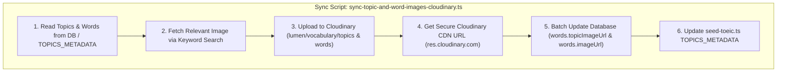

# Feature Plan: Unsplash-to-Cloudinary Pipeline for Topic & Word Images

> **Status**: Approved
> **Author**: Antigravity Pair Programmer / BA
> **Date**: 2026-09-24
> **Target Module**: `backend/src/scripts/...`, `backend/src/seed-toeic.ts`, `backend/src/contexts/vocabulary/...`

---

## 1. Overview & Objectives

Currently, system vocabulary topics and individual flashcards reference external direct Unsplash URLs (e.g., `https://images.unsplash.com/photo-1450133064473...`) hardcoded in `TOPICS_METADATA` and database records. Referencing direct external image provider URLs introduces risks:
- Potential broken links, rate-limiting, or CORS restrictions from external CDNs.
- Inability to apply unified image optimizations, transformations, WebP compression, and caching via Lumen's dedicated Cloudinary account.
- Inconsistent visual context for certain specialized topics and vocabulary items.

### Objectives:
1. **Automated Image Selection & Retrieval Pipeline**: Implement a Node.js/TypeScript CLI automation script (`sync-topic-and-word-images-cloudinary.ts`) that takes English topic names (e.g. *"Contracts"*, *"Business Planning"*, *"Apply and Interviewing"*) and word terms (e.g. *"expert"*, *"apply"*, *"contract"*), queries contextually accurate high-quality images, and downloads them.
2. **Cloudinary Asset Storage Migration**: Automatically stream/upload all retrieved topic and vocabulary images to Cloudinary under dedicated, structured folders:
   - Topics: `lumen/vocabulary/topics/{topic-slug}`
   - Words: `lumen/vocabulary/words/{word-slug}`
3. **Database & Seed Synchronization**: Update all `words` table records (`topicImageUrl` and `imageUrl`) with the newly generated Cloudinary CDN URLs (`https://res.cloudinary.com/...`). Synchronize `TOPICS_METADATA` in `seed-toeic.ts` so future database resets use Cloudinary URLs natively.

---

## 2. Requirements & Scope

### Functional Requirements

#### A. Automated Image Search & Selection
- Script receives English search keywords derived from:
  - English topic titles: e.g. `"business contract legal document"`, `"job interview application"`, `"accounting financial calculator"`.
  - Word terms: e.g. `"contract agreement signature"`, `"marketing strategy presentation"`.
- Uses Unsplash photo queries to fetch contextually accurate images for each of the 50 TOEIC topics and key vocabulary words.

#### B. Cloudinary Upload & Transformation Pipeline
- Folder organization on Cloudinary:
  - `lumen/vocabulary/topics/`: Holds 50 topic cover images.
  - `lumen/vocabulary/words/`: Holds vocabulary word visual aids.
- Upload parameters:
  - Format: Auto WebP / JPG optimization (`quality: 'auto'`, `fetch_format: 'auto'`).
  - Transformation: Crop to standard aspect ratios (1:1 square `w=400,h=400,c_fill` for topic avatars and word thumbnails).
- Uses Cloudinary credentials from `process.env` (`CLOUDINARY_CLOUD_NAME`, `CLOUDINARY_API_KEY`, `CLOUDINARY_API_SECRET`).

#### C. Database & Seed Data Updates
- Database Migration / Sync Script:
  - Update `words` table:
    `UPDATE words SET "topicImageUrl" = $1 WHERE topic = $2`
    `UPDATE words SET "imageUrl" = $3 WHERE term = $4`
- Seed File Update (`seed-toeic.ts`):
  - Replace all direct `images.unsplash.com` URLs in `TOPICS_METADATA` with Cloudinary CDN links (`https://res.cloudinary.com/.../lumen/vocabulary/topics/...`).

### Non-Functional Requirements
- **Idempotency & Cost Efficiency**: The script must check if a Cloudinary URL already exists before re-uploading to prevent duplicate quota consumption.
- **Fault Tolerance**: If an image download/upload fails for a word/topic, log a warning and fall back to the existing image URL without interrupting the batch execution.
- **Type Safety**: Strictly typed TypeScript script using TypeORM `DataSource` and NestJS Config.

### Out of Scope
- Modifying audio file sync (`upload-vocabulary-cloudinary.ts` audio handling remains unchanged).

---

## 3. UI/UX Specifications (Frontend)

- **CDN Fast Load**: All topic avatars and word thumbnails will load via Cloudinary's global CDN (`res.cloudinary.com`) with automatic WebP compression.
- **Image Unoptimization in Next.js**: Components using `<Image>` tag with `unoptimized` or Cloudinary loader will render smoothly with responsive sizing.

---

## 4. Architecture & Technical Contracts

---

## 5. File Change Matrix

| Action | File Path | Purpose |
| :--- | :--- | :--- |
| `[NEW]` | `backend/src/scripts/sync-topic-and-word-images-cloudinary.ts` | CLI script to fetch images, upload to Cloudinary, and update DB |
| `[MODIFY]` | `backend/src/seed-toeic.ts` | Update `TOPICS_METADATA` with Cloudinary CDN URLs |
| `[MODIFY]` | `backend/package.json` | Add CLI command `"seed:cloudinary-images"` |

---

## 6. Implementation & Quality Verification Checklist

- [x] Create `documents/features/topic-and-word-images-unsplash-cloudinary-pipeline.md`.
- [ ] Implement `sync-topic-and-word-images-cloudinary.ts`.
- [ ] Run the migration script locally using Cloudinary credentials.
- [ ] Verify Cloudinary dashboard: 50 topic images uploaded under `lumen/vocabulary/topics/` and word images uploaded under `lumen/vocabulary/words/`.
- [ ] Verify database: `words` table `topicImageUrl` and `imageUrl` columns updated to `https://res.cloudinary.com/...`.
- [ ] Update `TOPICS_METADATA` in `seed-toeic.ts`.
- [ ] Run `pnpm --filter backend build` to verify 0 TypeScript compilation errors.
- [ ] Test frontend UI: Topic cards load crisp images from Cloudinary CDN.

---

## 7. Risks & Technical Considerations

- **Cloudinary Rate Limits & Quotas**: Ensure batching with delay (`sleep(200)`) between requests to avoid exceeding free-tier API rate limits.
- **Image Relevance**: Verify query terms for all 50 TOEIC topics yield clear, high-quality business context photos.
