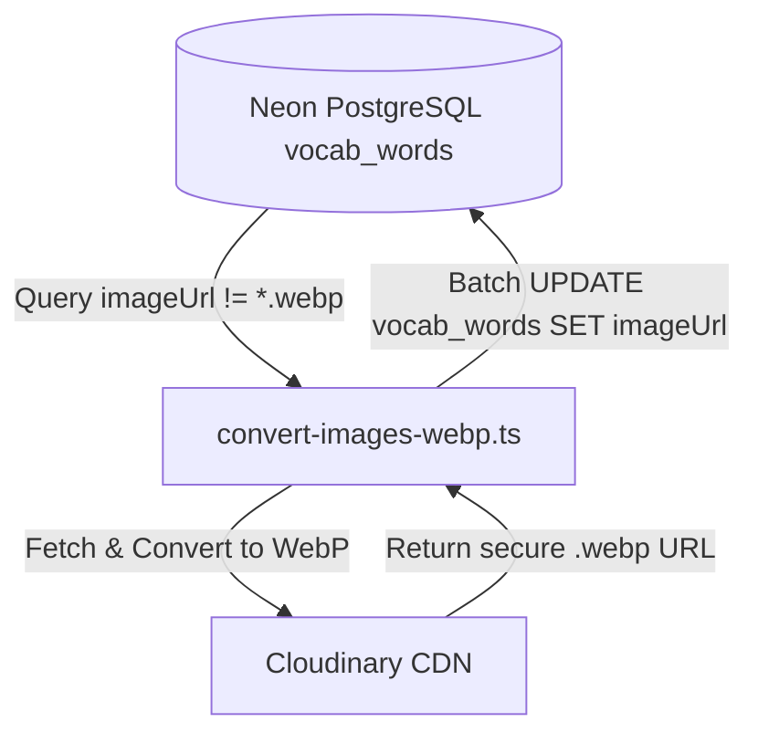

# Feature Plan: Vocabulary WebP Image Optimization & Migration

> **Status**: Completed  
> **Author**: Antigravity Pair Programmer / BA  
> **Date**: 2026-09-23  
> **Target Module**: backend/src/contexts/vocabulary

---

## 1. Overview & Objectives

Optimize all vocabulary illustration images across the Lumen platform by converting and storing them in modern **WebP** format. This achieves significant reduction in network bandwidth, accelerates image loading on client browsers (especially mobile devices), and standardizes image seeding and upload pipelines through a dedicated helper module.

---

## 2. Requirements & Scope

### Functional Requirements
1. **Dedicated WebP Image Upload Function (`convertAndUploadImageToWebp`)**:
   - Provide a clean, standalone helper function in `backend/src/contexts/vocabulary/infrastructure/helpers/cloudinary-image.helper.ts`.
   - Accept image input (remote URL, local file path, or Buffer) and target public ID / folder.
   - Force conversion to `webp` format (`format: 'webp'`, `transformation: [{ quality: 'auto', fetch_format: 'webp' }]`) on Cloudinary.
   - Return the secure HTTPS `.webp` URL.
2. **Unified Seeding & Upload Integration**:
   - Update `upload-vocabulary-cloudinary.ts` and `seed-toeic.ts` to automatically convert and save image URLs as `.webp`.
3. **Automated Cloudinary & Database Migration Script (`convert-images-webp.ts`)**:
   - Iterate through all records in `vocab_words` with existing non-WebP `imageUrl` (or Cloudinary `.jpg`/`.png` assets).
   - Convert/re-upload to Cloudinary with `format: 'webp'`.
   - Update `vocab_words.imageUrl` in Neon PostgreSQL database.
   - Add npm script: `pnpm seed:webp-images` (or `pnpm convert:images-webp`).

### Non-Functional Requirements
- **Reliability & Idempotency**: Running the migration script multiple times should safely skip already-converted `.webp` URLs.
- **Error Handling & Logging**: Detailed console progress logging (batches, success count, skipped count, error reporting).
- **Zero Schema Breaking Changes**: `vocab_words.imageUrl` remains standard `varchar` string, only the file format and URL extension change to `.webp`.

---

## 3. Architecture & Technical Contracts

### 3.1. Dedicated Helper Function Specification
```typescript
export interface UploadImageToCloudinaryOptions {
  folder?: string;
  publicId: string;
  overwrite?: boolean;
}

export async function convertAndUploadImageToWebp(
  source: string, // remote URL or local file path
  options: UploadImageToCloudinaryOptions,
): Promise<string>;
```

### 3.2. Migration Pipeline Flow


---

## 4. File Change Matrix

| Action | File Path | Purpose |
| :--- | :--- | :--- |
| `[NEW]` | `backend/src/contexts/vocabulary/infrastructure/helpers/cloudinary-image.helper.ts` | Standalone WebP conversion and upload helper |
| `[NEW]` | `backend/src/convert-images-webp.ts` | CLI maintenance script to convert existing DB images to WebP |
| `[MODIFY]` | `backend/src/seed-toeic.ts` | Default to `.webp` for Cloudinary image URLs |
| `[MODIFY]` | `backend/src/upload-vocabulary-cloudinary.ts` | Use `format: 'webp'` during upload |
| `[MODIFY]` | `backend/package.json` | Add `seed:webp-images` command |

---

## 5. Implementation & Quality Verification Checklist

- [x] Helper `convertAndUploadImageToWebp` supports remote URLs and local file paths.
- [x] Upload options enforce `format: 'webp'` and `quality: 'auto'`.
- [x] Migration script safely converts non-WebP images and updates database records idempotently.
- [x] Backend TypeScript build passes: `pnpm exec tsc --noEmit`.
- [x] Zero ESLint or syntax errors.
