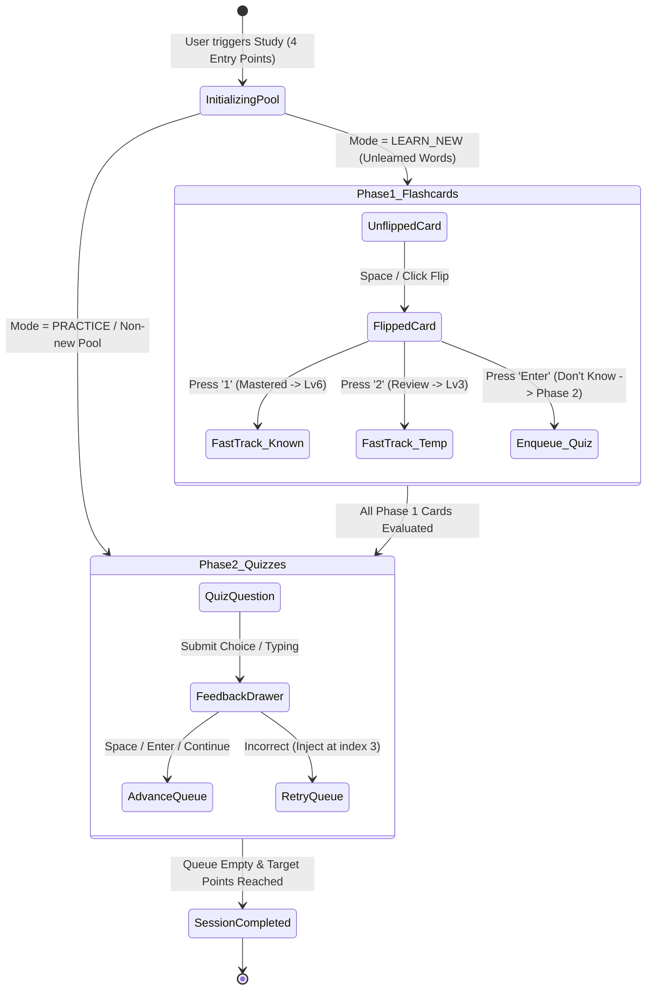

# Frontend Architecture Specification — Lumen

> **Framework**: Next.js 16 (App Router, Turbopack) + React 19 + TypeScript 5
> **State Management**: TanStack React Query v5 (Server State) + Zustand v5 (Client Global State)
> **Design System**: UIKit (`@lumen/uikit`), Base UI (`@base-ui/react`), Lucide React, Framer Motion
> **Internationalization**: `next-intl` (en, vi)

---

## 1. Monorepo Architecture (Turborepo + PNPM Workspaces)

```text
frontend/
├── apps/
│   └── web/                   # Main Next.js 16 Web Application
├── packages/
│   ├── uikit/                 # Shared UI Design System Components (Button, Dialog, Sheet, Tabs...)
│   ├── hooks/                 # Reusable React Custom Hooks (useToggle, useCounter, useDebounce...)
│   ├── utils/                 # Pure Utilities (string, timing, avatar, markdown...)
│   ├── shared-api/            # Shared DTOs & API Contracts
│   ├── eslint-config/         # Monorepo ESLint configuration
│   └── typescript-config/     # Shared tsconfig bases
```

---

## 2. Feature-Based Architecture (`apps/web/src/features/`)

All business capabilities are structured into modular feature domains:

```text
apps/web/src/features/
├── auth/                      # Authentication & Google OAuth Flows
├── dashboard/                 # Overview Dashboard, Quick Actions, Streak Widget
├── settings/                  # User Preferences, Daily Quota, Audio Mode
├── study/                     # Interactive Study Engine & State Machine
│   ├── components/            # Study Dialog, Exercise Views, Drawers, Exit Modal
│   ├── constants/             # Shortcut Keys, Quota Tiers, Animations
│   ├── hooks/                 # Session Hook, Audio, Shortcuts, Popstate Hook
│   ├── types/                 # StudyQueueItem, ExerciseType, Rating Enums
│   └── utils/                 # Pool Resolver, Quiz Generator, Progress Calculations
└── vocabulary/                # Vocabulary, Decks, Folders & Words
    ├── components/            # Folder Cards, Word Sheets, Add Flashcard Dialog
    ├── hooks/                 # Folder Queries, Word Mutators
    ├── pages/                 # Folder List, Folder Detail, Topic Detail
    └── utils/                 # Folder Localization, Topic Grouping
```

---

## 3. Study Session Engine & State Machine

The Study Engine is modeled as an interactive state machine orchestrated through `useStudySession`:



### Multi-Layer Exit Protection
1. **`Escape` Key**: Intercepted in `useStudyShortcuts`; prompts `StudyConfirmExitDialog`.
2. **Backdrop & Outside Clicks**: Blocked on `<DialogContent onPointerDownOutside={(e) => e.preventDefault()}>`.
3. **Browser Back / Mobile Swipe Back**: Handled via `useBlockBrowserBack` by pushing a sentinel state `{ isStudySession: true }` into `window.history` and catching `popstate` to open the exit confirmation dialog safely.

---

## 4. UI Design System Guidelines

1. **Button Rule**: Always use `<Button>` variant props (`default`, `secondary`, `outline`, `ghost`, `subtle`, `destructive`) and size props. Never override inline borders/backgrounds manually.
2. **Airy & Anti-Card-Clutter**: Never nest cards inside cards (`box-in-box`). Use clean typography, natural spacing, and flat subtle borders (`border-border/60`).
3. **Strict Hook Length Limit**: Hooks must not exceed 300 lines. Complex hooks must decompose into pure utilities in `utils/` and unidirectional sub-hooks.

---

## 5. Responsive Strategy & SSR Hydration Safety (CSS-First Principle)

### 5.1 The SSR Hydration Mismatch & Layout Shift Problem
In Next.js server-side rendering, `window.matchMedia` and viewport dimensions are unavailable on the server. If React components perform JSX branching based on viewport dimensions (`{isMobile ? <MobileView /> : <DesktopView />}`), the following issues occur:
1. **React Hydration Error**: Server HTML does not match client initial render.
2. **Cumulative Layout Shift (CLS)**: The user experiences a jarring visual layout shift when client JavaScript mounts and changes the tree.
3. **Performance Penalty**: Layout rendering is blocked until client JS executes.

### 5.2 The CSS-First Solution
* **100% CSS-First for Layout, Spacing, and Visibility**: Always use Tailwind responsive classes (`hidden md:block`, `flex md:hidden`, `sm:grid-cols-2`, `w-full lg:w-auto`). CSS is evaluated instantly by the browser before JS execution, ensuring 0ms CLS and 100% SSR hydration safety.
* **`useBreakpoint` / `useMediaQuery`**: Reserved strictly for non-visual imperative JavaScript behaviors (canvas charting calculations, portal/tooltip placement, touch event attachments). Breakpoints are aligned directly with Tailwind CSS (`sm: 640px`, `md: 768px`, `lg: 1024px`, `xl: 1280px`, `2xl: 1536px`).

---

## 6. Keyboard Shortcuts & Event Handling (`useKeyPress`)

* Centralized in `@lumen/hooks` via `useKeyPress`.
* Provides key matching (`single`, `array`, `predicate`), modifier keys (`ctrlOrMeta`, `shift`, `alt`), automatic input element ignoring (`ignoreInputElements: true`), and stable callback execution without listener re-binding.

