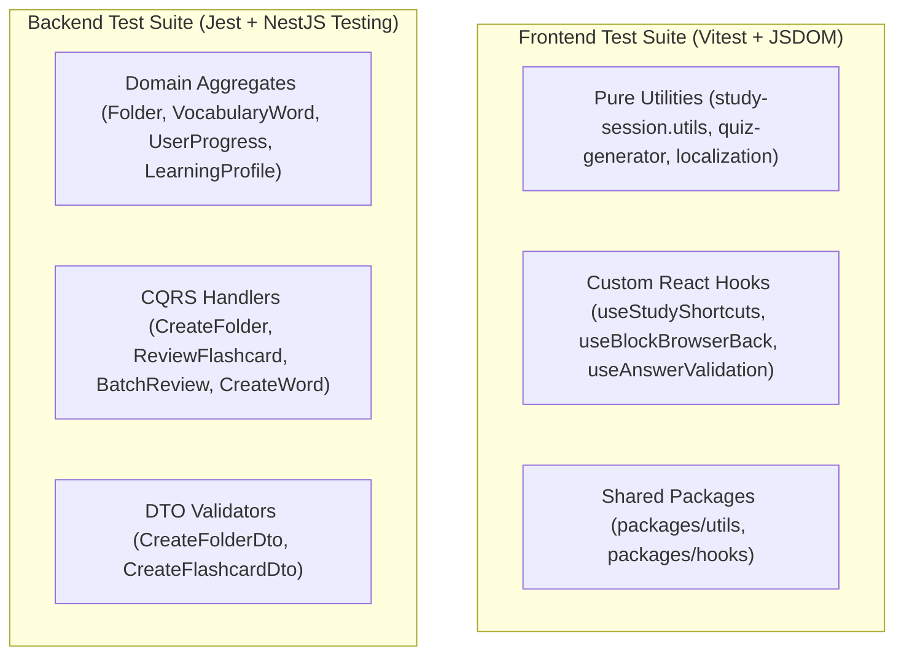

# Testing & Quality Control (QC) Architecture — Lumen

> **Status**: Standardized & Enforced Across All Repositories
> **Frameworks**: Vitest 4 + React Testing Library (Frontend) · Jest 30 + NestJS Testing Module (Backend)
> **Total Active Unit Tests**: 98 Automated Tests (19 Test Suites, 100% Pass Rate)
> **Last Updated**: 2026-09-21

---

## 1. Quality Control Philosophy

1. **Deterministic Execution**:
   - Zero tolerance for test flakiness.
   - All tests must use fake timers (`vi.useFakeTimers()` / `jest.useFakeTimers()`) when testing time-sensitive logic (streaks, intervals, debounces, timeouts).
   - Zero network dependencies: all external boundaries (Repositories, EventBuses, HTTP Clients) are mocked with strongly typed mocks.
2. **AAA (Arrange - Act - Assert) Standard**:
   - Every single test case strictly isolates test setup, execution, and verification.
3. **Behavior-Driven Naming**:
   - Format: `it('should [expected output/state] when [specific condition/trigger]', () => ...)`

---

## 2. Test Architecture by Layer



---

## 3. Active Test Suites Matrix

### A. Frontend Test Suites (`pnpm --filter web test`)

| File Path | Tested Functionality | Tests Count |
| :--- | :--- | :--- |
| [`study-session.utils.spec.ts`](file:///d:/learn/lumen/frontend/apps/web/src/features/study/utils/tests/study-session.utils.spec.ts) | SRS progress calculation, pool resolution, session points, missed word ranking | **17** |
| [`quiz-generator.spec.ts`](file:///d:/learn/lumen/frontend/apps/web/src/features/study/utils/tests/quiz-generator.spec.ts) | Distractor card selection hierarchy, choice question generation, typing exercise fallback | **11** |
| [`timing.spec.ts`](file:///d:/learn/lumen/frontend/packages/utils/src/tests/timing.spec.ts) | `debounce`, `throttle`, `sleep` with fake timers, `formatDuration` | **7** |
| [`use-study-shortcuts.spec.ts`](file:///d:/learn/lumen/frontend/apps/web/src/features/study/hooks/tests/use-study-shortcuts.spec.ts) | Space flip, 1-4 ratings/choice keys, audio playback shortcuts, Escape close | **6** |
| [`folder-localization.utils.spec.ts`](file:///d:/learn/lumen/frontend/apps/web/src/features/vocabulary/utils/tests/folder-localization.utils.spec.ts) | Multilingual I18nString parsing and fallback locale resolution | **5** |
| [`use-block-browser-back.spec.ts`](file:///d:/learn/lumen/frontend/apps/web/src/features/study/hooks/tests/use-block-browser-back.spec.ts) | `popstate` history manipulation and safe unblocking | **4** |
| [`string.spec.ts`](file:///d:/learn/lumen/frontend/packages/utils/src/tests/string.spec.ts) | `getUserInitials` extraction from full names and email addresses | **4** |
| [`use-counter.spec.ts`](file:///d:/learn/lumen/frontend/packages/hooks/src/tests/use-counter.spec.ts) | Bound limits, delta increments/decrements, reset actions | **4** |
| [`use-toggle.spec.ts`](file:///d:/learn/lumen/frontend/packages/hooks/src/tests/use-toggle.spec.ts) | Boolean state toggle and explicit value overrides | **3** |
| [`use-study-answer-validation.spec.ts`](file:///d:/learn/lumen/frontend/apps/web/src/features/study/hooks/tests/use-study-answer-validation.spec.ts) | Choice & Typing answer verification, pending review recording | **3** |

### B. Backend Test Suites (`pnpm --filter backend test`)

| File Path | Tested Functionality | Tests Count |
| :--- | :--- | :--- |
| [`learning-profile.aggregate.spec.ts`](file:///d:/learn/lumen/backend/src/contexts/progress/domain/aggregates/tests/learning-profile.aggregate.spec.ts) | Streaks, Streak Freezes, XP thresholds, Badges, fake timer determinism | **8** |
| [`user-progress.aggregate.spec.ts`](file:///d:/learn/lumen/backend/src/contexts/vocabulary/domain/aggregates/tests/user-progress.aggregate.spec.ts) | Fast Track Known/Temp, Level 0 graduation, penalty calculations, reset to unlearned | **6** |
| [`folder.aggregate.spec.ts`](file:///d:/learn/lumen/backend/src/contexts/vocabulary/domain/aggregates/tests/folder.aggregate.spec.ts) | Aggregate invariants, `FolderCreatedEvent`, multilingual getters | **4** |
| [`folder-flashcard.dto.spec.ts`](file:///d:/learn/lumen/backend/src/contexts/vocabulary/application/dtos/tests/folder-flashcard.dto.spec.ts) | Class-validator validation (`@IsUUID`, `@IsNotEmpty`, `@IsString`) | **4** |
| [`vocabulary-word.aggregate.spec.ts`](file:///d:/learn/lumen/backend/src/contexts/vocabulary/domain/aggregates/tests/vocabulary-word.aggregate.spec.ts) | Word instantiation, phonetic & US/UK audio attributes, partial update | **3** |
| [`review-flashcard.handler.spec.ts`](file:///d:/learn/lumen/backend/src/contexts/vocabulary/application/commands/tests/review-flashcard.handler.spec.ts) | Review command orchestration, flashcard not found exception, event publishing | **3** |
| [`batch-review-flashcards.handler.spec.ts`](file:///d:/learn/lumen/backend/src/contexts/vocabulary/application/commands/tests/batch-review-flashcards.handler.spec.ts) | Batch review iterations, missing card skipping, bulk event emission | **2** |
| [`create-vocabulary-word.handler.spec.ts`](file:///d:/learn/lumen/backend/src/contexts/vocabulary/application/commands/tests/create-vocabulary-word.handler.spec.ts) | Word duplicate prevention, definitions creation, audio enrichment adapter | **2** |
| [`create-folder.handler.spec.ts`](file:///d:/learn/lumen/backend/src/contexts/vocabulary/application/commands/tests/create-folder.handler.spec.ts) | Create folder handler with repository mock | **2** |

---

## 4. Test Execution & CI Commands

```bash
# Run all Frontend Unit Tests
pnpm --filter web test

# Run all Backend Unit Tests
pnpm --filter backend test

# Run Type and Lint Quality Gates
pnpm --filter backend lint
pnpm --filter backend build
pnpm --filter web build
```
